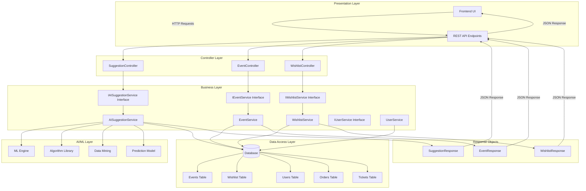
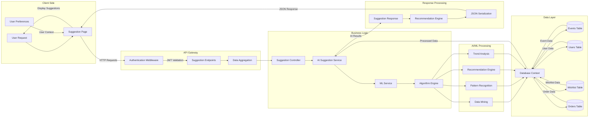
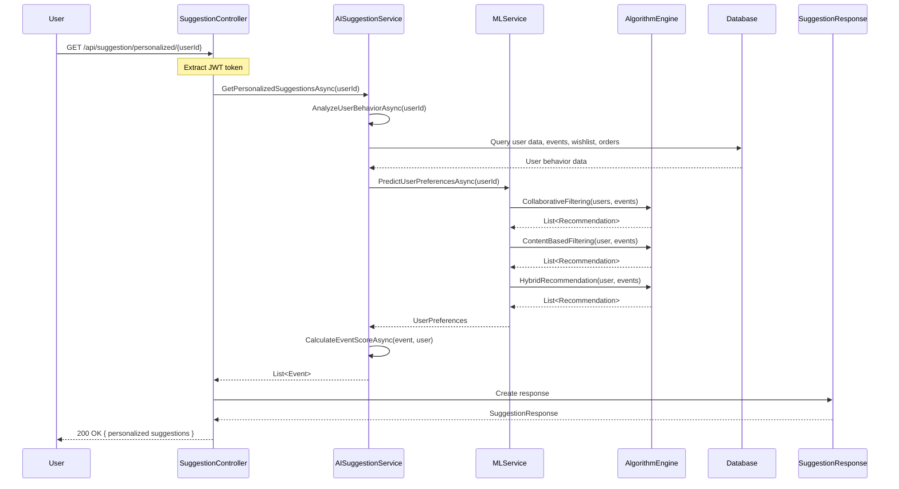
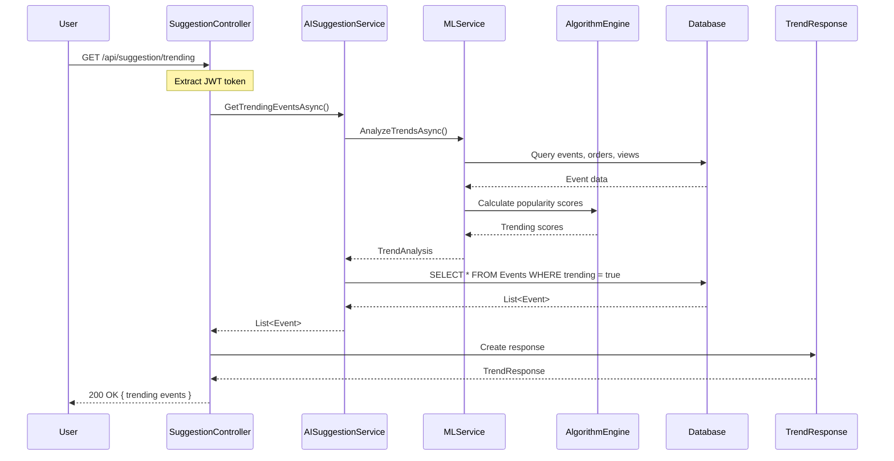
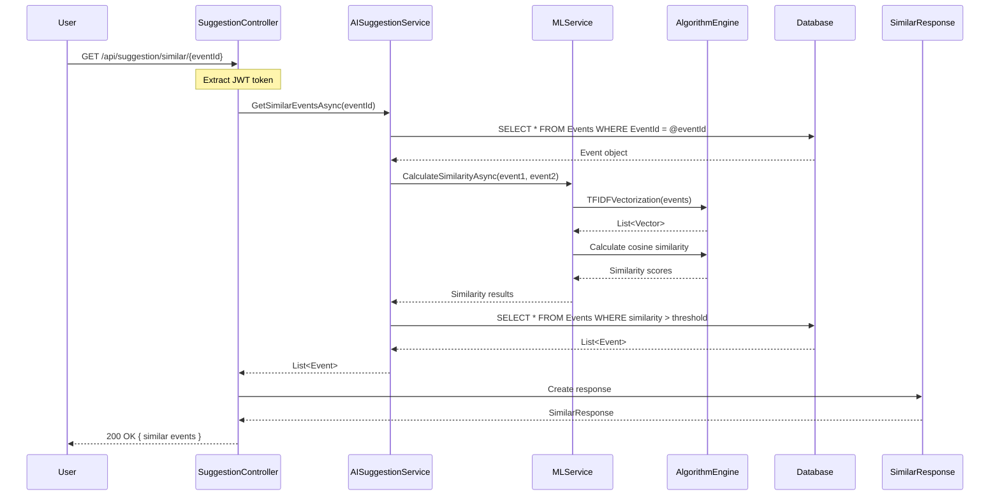
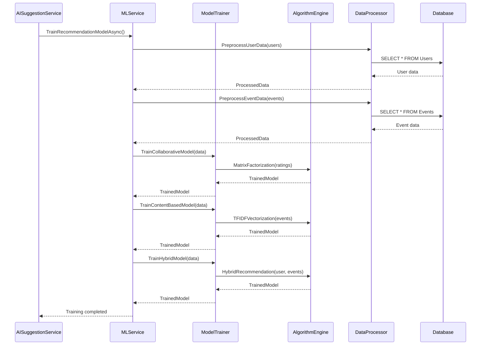
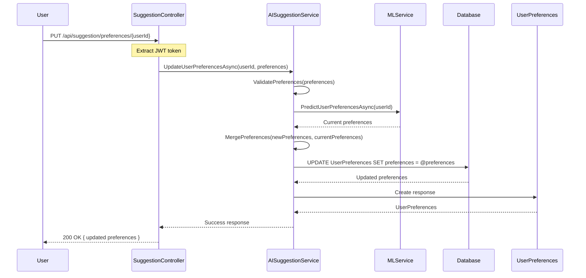
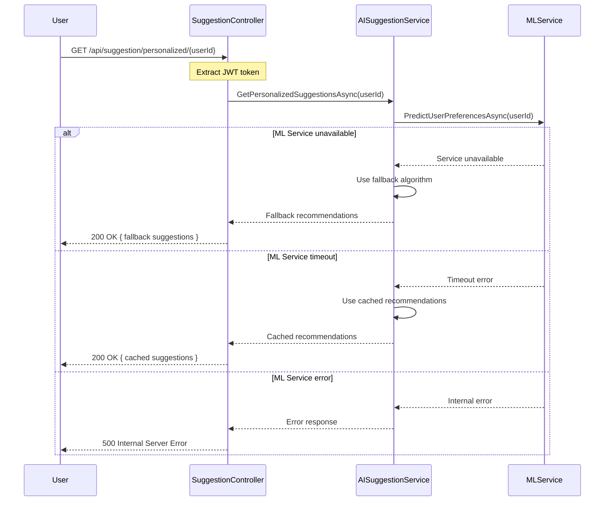

# 1. A.I Suggestion Feature

[Detailed design for the A.I Suggestion function. It includes Class Diagram, Class Specifications, and Sequence Diagram(s)]

## a. Class Diagram

[This part presents the class diagram for the A.I Suggestion feature]

### System Architecture Overview



### Class Diagram

```mermaid
classDiagram
    class SuggestionController {
        -IAISuggestionService _suggestionService
        -IEventService _eventService
        -IWishlistService _wishlistService
        +GetPersonalizedSuggestions(userId) IActionResult
        +GetTrendingEvents() IActionResult
        +GetSimilarEvents(eventId) IActionResult
        +GetRecommendedEvents(userId) IActionResult
        +GetUserPreferences(userId) IActionResult
        +UpdateUserPreferences(userId, preferences) IActionResult
    }

    class AISuggestionService {
        -IEventRepository _eventRepository
        -IWishlistRepository _wishlistRepository
        -IUserRepository _userRepository
        -IOrderRepository _orderRepository
        -IMLService _mlService
        +GetPersonalizedSuggestionsAsync(userId) List~Event~
        +GetTrendingEventsAsync() List~Event~
        +GetSimilarEventsAsync(eventId) List~Event~
        +GetRecommendedEventsAsync(userId) List~Event~
        +AnalyzeUserBehaviorAsync(userId) UserBehavior
        +CalculateEventScoreAsync(event, user) decimal
        +GenerateRecommendationsAsync(userId) List~Recommendation~
    }

    class MLService {
        -IAlgorithmEngine _algorithmEngine
        -IDataProcessor _dataProcessor
        -IModelTrainer _modelTrainer
        +TrainRecommendationModelAsync() bool
        +PredictUserPreferencesAsync(userId) UserPreferences
        +CalculateSimilarityAsync(event1, event2) decimal
        +ClusterUsersAsync() List~UserCluster~
        +AnalyzeTrendsAsync() TrendAnalysis
    }

    class AlgorithmEngine {
        +CollaborativeFiltering(users, events) List~Recommendation~
        +ContentBasedFiltering(user, events) List~Recommendation~
        +HybridRecommendation(user, events) List~Recommendation~
        +MatrixFactorization(ratings) List~Recommendation~
        +KMeansClustering(users) List~UserCluster~
        +TFIDFVectorization(events) List~Vector~
    }

    class DataProcessor {
        +PreprocessUserData(users) ProcessedData
        +PreprocessEventData(events) ProcessedData
        +ExtractFeatures(events) List~Feature~
        +NormalizeData(data) NormalizedData
        +CleanData(data) CleanedData
    }

    class ModelTrainer {
        +TrainCollaborativeModel(data) TrainedModel
        +TrainContentBasedModel(data) TrainedModel
        +TrainHybridModel(data) TrainedModel
        +ValidateModel(model, testData) ValidationResult
        +OptimizeModel(model) OptimizedModel
    }

    class UserBehavior {
        +int UserId
        +List~Event~ ViewedEvents
        +List~Event~ PurchasedEvents
        +List~Event~ WishlistEvents
        +List~Category~ PreferredCategories
        +List~Location~ PreferredLocations
        +DateTime LastActivity
        +decimal EngagementScore
    }

    class UserPreferences {
        +int UserId
        +List~Category~ PreferredCategories
        +List~Location~ PreferredLocations
        +List~PriceRange~ PreferredPriceRanges
        +List~DateTime~ PreferredTimeSlots
        +string PreferredEventType
        +decimal ConfidenceScore
    }

    class Recommendation {
        +int EventId
        +string Title
        +string Category
        +string Location
        +DateTime StartTime
        +decimal Price
        +decimal Score
        +string Reason
        +string RecommendationType
    }

    class TrendAnalysis {
        +List~TrendingEvent~ TrendingEvents
        +List~PopularCategory~ PopularCategories
        +List~HotLocation~ HotLocations
        +DateTime AnalysisDate
        +decimal TrendConfidence
    }

    class UserCluster {
        +int ClusterId
        +string ClusterName
        +List~User~ Users
        +List~Event~ RecommendedEvents
        +decimal ClusterScore
    }

    class SuggestionResponse {
        +List~Recommendation~ PersonalizedSuggestions
        +List~Event~ TrendingEvents
        +List~Event~ SimilarEvents
        +UserPreferences UserPreferences
        +TrendAnalysis TrendAnalysis
        +DateTime GeneratedAt
    }

    class Event {
        +int EventId
        +string Title
        +string Description
        +string Category
        +string Location
        +DateTime StartTime
        +DateTime EndTime
        +decimal Price
        +string Status
        +int HostId
    }

    class User {
        +int UserId
        +string Username
        +string FullName
        +string Email
        +string Role
        +DateTime CreatedAt
        +DateTime LastLogin
    }

    class Wishlist {
        +int WishlistId
        +int UserId
        +int EventId
        +DateTime CreatedAt
    }

    class Order {
        +int OrderId
        +int CustomerId
        +decimal Amount
        +string Status
        +DateTime CreatedAt
    }

    SuggestionController --> IAISuggestionService : uses
    SuggestionController --> IEventService : uses
    SuggestionController --> IWishlistService : uses
    AISuggestionService ..|> IAISuggestionService : implements
    AISuggestionService --> MLService : uses
    AISuggestionService --> EventRepository : uses
    AISuggestionService --> WishlistRepository : uses
    AISuggestionService --> UserRepository : uses
    AISuggestionService --> OrderRepository : uses
    MLService --> AlgorithmEngine : uses
    MLService --> DataProcessor : uses
    MLService --> ModelTrainer : uses
    AISuggestionService --> UserBehavior : creates
    AISuggestionService --> UserPreferences : creates
    AISuggestionService --> Recommendation : creates
    MLService --> TrendAnalysis : creates
    MLService --> UserCluster : creates
    SuggestionController --> SuggestionResponse : creates
    User ||--o{ Wishlist : has
    User ||--o{ Order : places
    Event ||--o{ Wishlist : in
    Event ||--o{ Order : generates
```

### Data Flow Diagram



### API Endpoints Overview

```mermaid
graph TD
    subgraph "AI Suggestion API Endpoints"
        A[GET /api/suggestion/personalized/{userId}]
        B[GET /api/suggestion/trending]
        C[GET /api/suggestion/similar/{eventId}]
        D[GET /api/suggestion/recommended/{userId}]
        E[GET /api/suggestion/preferences/{userId}]
        F[PUT /api/suggestion/preferences/{userId}]
    end
    
    subgraph "Authentication"
        G[JWT Token Validation]
        H[User ID Extraction]
    end
    
    subgraph "AI Processing"
        I[User Behavior Analysis]
        J[Content-Based Filtering]
        K[Collaborative Filtering]
        L[Trend Analysis]
        M[Similarity Calculation]
    end
    
    subgraph "Database Operations"
        N[Query User Data]
        O[Query Event Data]
        P[Query Wishlist Data]
        Q[Query Order Data]
        R[Aggregate Statistics]
    end
    
    subgraph "Response Objects"
        S[PersonalizedSuggestions]
        T[TrendingEvents]
        U[SimilarEvents]
        V[UserPreferences]
        W[RecommendationScore]
    end
    
    A --> G
    B --> G
    C --> G
    D --> G
    E --> G
    F --> G
    
    G --> H
    H --> I
    H --> J
    H --> K
    H --> L
    H --> M
    
    I --> N
    J --> O
    K --> P
    L --> Q
    M --> R
    
    N --> S
    O --> T
    P --> U
    Q --> V
    R --> W
```

## b. Class Specifications

[Provide the description for each class and the methods in each class, following the table format as below]

### SuggestionController Class

| No | Method | Description |
|---|---|---|
| 01 | GetPersonalizedSuggestions() | Input: userId, JWT Token. Process: Gets personalized event suggestions based on user behavior. Output: Returns SuggestionResponse with personalized recommendations. |
| 02 | GetTrendingEvents() | Input: JWT Token. Process: Gets currently trending events based on popularity and engagement. Output: Returns list of trending events. |
| 03 | GetSimilarEvents() | Input: eventId, JWT Token. Process: Gets events similar to the specified event. Output: Returns list of similar events. |
| 04 | GetRecommendedEvents() | Input: userId, JWT Token. Process: Gets recommended events for user based on AI analysis. Output: Returns list of recommended events. |
| 05 | GetUserPreferences() | Input: userId, JWT Token. Process: Gets user's AI-learned preferences. Output: Returns UserPreferences object. |
| 06 | UpdateUserPreferences() | Input: userId, preferences, JWT Token. Process: Updates user preferences for better recommendations. Output: Returns success response. |

### AISuggestionService Class

| No | Method | Description |
|---|---|---|
| 01 | GetPersonalizedSuggestionsAsync() | Input: userId. Process: Analyzes user behavior and generates personalized suggestions. Output: Returns List<Event> with personalized recommendations. |
| 02 | GetTrendingEventsAsync() | Input: None. Process: Analyzes current trends and popular events. Output: Returns List<Event> with trending events. |
| 03 | GetSimilarEventsAsync() | Input: eventId. Process: Finds events similar to the specified event using content-based filtering. Output: Returns List<Event> with similar events. |
| 04 | GetRecommendedEventsAsync() | Input: userId. Process: Generates recommendations using hybrid approach. Output: Returns List<Event> with recommended events. |
| 05 | AnalyzeUserBehaviorAsync() | Input: userId. Process: Analyzes user's interaction patterns and preferences. Output: Returns UserBehavior object. |
| 06 | CalculateEventScoreAsync() | Input: event, user. Process: Calculates relevance score for event-user pair. Output: Returns decimal score. |
| 07 | GenerateRecommendationsAsync() | Input: userId. Process: Generates comprehensive recommendations using multiple algorithms. Output: Returns List<Recommendation> objects. |

### MLService Class

| No | Method | Description |
|---|---|---|
| 01 | TrainRecommendationModelAsync() | Input: None. Process: Trains recommendation models using historical data. Output: Returns boolean indicating success. |
| 02 | PredictUserPreferencesAsync() | Input: userId. Process: Predicts user preferences using ML models. Output: Returns UserPreferences object. |
| 03 | CalculateSimilarityAsync() | Input: event1, event2. Process: Calculates similarity between two events. Output: Returns decimal similarity score. |
| 04 | ClusterUsersAsync() | Input: None. Process: Groups users with similar preferences. Output: Returns List<UserCluster> objects. |
| 05 | AnalyzeTrendsAsync() | Input: None. Process: Analyzes current trends and patterns. Output: Returns TrendAnalysis object. |

### AlgorithmEngine Class

| No | Method | Description |
|---|---|---|
| 01 | CollaborativeFiltering() | Input: users, events. Process: Recommends events based on similar users' preferences. Output: Returns List<Recommendation> objects. |
| 02 | ContentBasedFiltering() | Input: user, events. Process: Recommends events based on content similarity. Output: Returns List<Recommendation> objects. |
| 03 | HybridRecommendation() | Input: user, events. Process: Combines collaborative and content-based filtering. Output: Returns List<Recommendation> objects. |
| 04 | MatrixFactorization() | Input: ratings. Process: Uses matrix factorization for recommendations. Output: Returns List<Recommendation> objects. |
| 05 | KMeansClustering() | Input: users. Process: Groups users into clusters using K-means. Output: Returns List<UserCluster> objects. |
| 06 | TFIDFVectorization() | Input: events. Process: Converts event descriptions to TF-IDF vectors. Output: Returns List<Vector> objects. |

### DataProcessor Class

| No | Method | Description |
|---|---|---|
| 01 | PreprocessUserData() | Input: users. Process: Cleans and preprocesses user data for ML. Output: Returns ProcessedData object. |
| 02 | PreprocessEventData() | Input: events. Process: Cleans and preprocesses event data for ML. Output: Returns ProcessedData object. |
| 03 | ExtractFeatures() | Input: events. Process: Extracts relevant features from events. Output: Returns List<Feature> objects. |
| 04 | NormalizeData() | Input: data. Process: Normalizes data for ML algorithms. Output: Returns NormalizedData object. |
| 05 | CleanData() | Input: data. Process: Removes noise and outliers from data. Output: Returns CleanedData object. |

### ModelTrainer Class

| No | Method | Description |
|---|---|---|
| 01 | TrainCollaborativeModel() | Input: data. Process: Trains collaborative filtering model. Output: Returns TrainedModel object. |
| 02 | TrainContentBasedModel() | Input: data. Process: Trains content-based filtering model. Output: Returns TrainedModel object. |
| 03 | TrainHybridModel() | Input: data. Process: Trains hybrid recommendation model. Output: Returns TrainedModel object. |
| 04 | ValidateModel() | Input: model, testData. Process: Validates model performance. Output: Returns ValidationResult object. |
| 05 | OptimizeModel() | Input: model. Process: Optimizes model parameters. Output: Returns OptimizedModel object. |

### UserBehavior Class

| No | Method | Description |
|---|---|---|
| 01 | AnalyzeViewingPatterns() | Process: Analyzes user's event viewing patterns. Output: Returns viewing insights. |
| 02 | AnalyzePurchasePatterns() | Process: Analyzes user's purchase patterns. Output: Returns purchase insights. |
| 03 | CalculateEngagementScore() | Process: Calculates user engagement score. Output: Returns decimal engagement score. |
| 04 | GetPreferredCategories() | Process: Identifies user's preferred event categories. Output: Returns List<Category> objects. |
| 05 | GetPreferredLocations() | Process: Identifies user's preferred event locations. Output: Returns List<Location> objects. |

### UserPreferences Class

| No | Method | Description |
|---|---|---|
| 01 | UpdatePreferences() | Input: newPreferences. Process: Updates user preferences based on behavior. Output: Returns boolean indicating success. |
| 02 | GetConfidenceScore() | Process: Calculates confidence in preference predictions. Output: Returns decimal confidence score. |
| 03 | ValidatePreferences() | Process: Validates preference consistency. Output: Returns boolean indicating validity. |
| 04 | MergePreferences() | Input: otherPreferences. Process: Merges with other preference sources. Output: Returns merged preferences. |

### Recommendation Class

| No | Method | Description |
|---|---|---|
| 01 | CalculateScore() | Process: Calculates recommendation score. Output: Returns decimal score. |
| 02 | GetReason() | Process: Gets explanation for recommendation. Output: Returns string reason. |
| 03 | GetRecommendationType() | Process: Gets type of recommendation algorithm used. Output: Returns string type. |
| 04 | ValidateRecommendation() | Process: Validates recommendation quality. Output: Returns boolean indicating validity. |

### TrendAnalysis Class

| No | Method | Description |
|---|---|---|
| 01 | AnalyzeTrendingEvents() | Process: Identifies currently trending events. Output: Returns List<TrendingEvent> objects. |
| 02 | AnalyzePopularCategories() | Process: Identifies popular event categories. Output: Returns List<PopularCategory> objects. |
| 03 | AnalyzeHotLocations() | Process: Identifies popular event locations. Output: Returns List<HotLocation> objects. |
| 04 | CalculateTrendConfidence() | Process: Calculates confidence in trend analysis. Output: Returns decimal confidence score. |

### UserCluster Class

| No | Method | Description |
|---|---|---|
| 01 | AddUser() | Input: user. Process: Adds user to cluster. Output: Returns boolean indicating success. |
| 02 | RemoveUser() | Input: user. Process: Removes user from cluster. Output: Returns boolean indicating success. |
| 03 | GetClusterScore() | Process: Calculates cluster quality score. Output: Returns decimal score. |
| 04 | GetRecommendedEvents() | Process: Gets events recommended for cluster. Output: Returns List<Event> objects. |

## c. Sequence Diagram(s)

[Provide the sequence diagram(s) for the A.I Suggestion feature]

### Sequence Diagram 1: Get Personalized Suggestions



### Sequence Diagram 2: Get Trending Events



### Sequence Diagram 3: Get Similar Events



### Sequence Diagram 4: Train Recommendation Model



### Sequence Diagram 5: Update User Preferences



### Sequence Diagram 6: Error Handling - AI Service Failure



## d. Database Queries

[Provide the detailed SQL queries which are used in implementing the A.I Suggestion function]

### Query 1: Get User Behavior Data
```sql
SELECT 
    u.UserId, u.Username, u.FullName, u.Email,
    COUNT(DISTINCT o.OrderId) as TotalOrders,
    COUNT(DISTINCT w.WishlistId) as TotalWishlistItems,
    COUNT(DISTINCT e.EventId) as EventsCreated,
    AVG(o.Amount) as AverageOrderAmount,
    MAX(o.CreatedAt) as LastOrderDate,
    MAX(w.CreatedAt) as LastWishlistDate
FROM Users u
LEFT JOIN Orders o ON u.UserId = o.CustomerId
LEFT JOIN Wishlist w ON u.UserId = w.UserId
LEFT JOIN Events e ON u.UserId = e.HostId
WHERE u.UserId = @userId
GROUP BY u.UserId, u.Username, u.FullName, u.Email
```

### Query 2: Get User Event Interactions
```sql
SELECT 
    e.EventId, e.Title, e.Category, e.Location, e.StartTime,
    COUNT(o.OrderId) as PurchaseCount,
    COUNT(w.WishlistId) as WishlistCount,
    AVG(tt.Price) as AveragePrice
FROM Events e
LEFT JOIN TicketTypes tt ON e.EventId = tt.EventId
LEFT JOIN OrderItems oi ON tt.TicketTypeId = oi.TicketTypeId
LEFT JOIN Orders o ON oi.OrderId = o.OrderId AND o.CustomerId = @userId
LEFT JOIN Wishlist w ON e.EventId = w.EventId AND w.UserId = @userId
WHERE e.Status = 'Open'
GROUP BY e.EventId, e.Title, e.Category, e.Location, e.StartTime
ORDER BY PurchaseCount DESC, WishlistCount DESC
```

### Query 3: Get Trending Events
```sql
SELECT 
    e.EventId, e.Title, e.Category, e.Location, e.StartTime, e.Price,
    COUNT(o.OrderId) as OrderCount,
    COUNT(w.WishlistId) as WishlistCount,
    COUNT(DISTINCT o.CustomerId) as UniqueCustomers,
    (COUNT(o.OrderId) * 0.7 + COUNT(w.WishlistId) * 0.3) as TrendingScore
FROM Events e
LEFT JOIN TicketTypes tt ON e.EventId = tt.EventId
LEFT JOIN OrderItems oi ON tt.TicketTypeId = oi.TicketTypeId
LEFT JOIN Orders o ON oi.OrderId = o.OrderId AND o.Status = 'Paid'
LEFT JOIN Wishlist w ON e.EventId = w.EventId
WHERE e.Status = 'Open' AND e.StartTime > GETDATE()
GROUP BY e.EventId, e.Title, e.Category, e.Location, e.StartTime, e.Price
HAVING COUNT(o.OrderId) > 0 OR COUNT(w.WishlistId) > 0
ORDER BY TrendingScore DESC
```

### Query 4: Get Similar Events by Category
```sql
SELECT 
    e2.EventId, e2.Title, e2.Category, e2.Location, e2.StartTime, e2.Price,
    CASE 
        WHEN e2.Category = e1.Category THEN 0.8
        ELSE 0.2
    END as CategorySimilarity,
    CASE 
        WHEN e2.Location = e1.Location THEN 0.6
        ELSE 0.1
    END as LocationSimilarity
FROM Events e1
CROSS JOIN Events e2
WHERE e1.EventId = @eventId 
    AND e2.EventId != @eventId 
    AND e2.Status = 'Open'
    AND e2.StartTime > GETDATE()
ORDER BY (CategorySimilarity + LocationSimilarity) DESC
```

### Query 5: Get User Preferences
```sql
SELECT 
    u.UserId,
    e.Category,
    COUNT(*) as CategoryCount,
    e.Location,
    COUNT(*) as LocationCount,
    AVG(tt.Price) as AveragePrice,
    COUNT(DISTINCT DATEPART(hour, e.StartTime)) as PreferredHours
FROM Users u
INNER JOIN Orders o ON u.UserId = o.CustomerId
INNER JOIN OrderItems oi ON o.OrderId = oi.OrderId
INNER JOIN TicketTypes tt ON oi.TicketTypeId = tt.TicketTypeId
INNER JOIN Events e ON tt.EventId = e.EventId
WHERE u.UserId = @userId AND o.Status = 'Paid'
GROUP BY u.UserId, e.Category, e.Location
ORDER BY CategoryCount DESC, LocationCount DESC
```

### Query 6: Get Collaborative Filtering Data
```sql
SELECT 
    o.CustomerId,
    e.EventId,
    e.Category,
    e.Location,
    COUNT(*) as InteractionCount,
    AVG(tt.Price) as AveragePrice
FROM Orders o
INNER JOIN OrderItems oi ON o.OrderId = oi.OrderId
INNER JOIN TicketTypes tt ON oi.TicketTypeId = tt.TicketTypeId
INNER JOIN Events e ON tt.EventId = e.EventId
WHERE o.Status = 'Paid'
GROUP BY o.CustomerId, e.EventId, e.Category, e.Location
HAVING COUNT(*) > 0
```

### Query 7: Get Content-Based Filtering Data
```sql
SELECT 
    e.EventId, e.Title, e.Description, e.Category, e.Location,
    e.StartTime, e.EndTime, e.Price,
    COUNT(tt.TicketTypeId) as TicketTypeCount,
    SUM(tt.Quantity) as TotalTickets,
    AVG(tt.Price) as AverageTicketPrice
FROM Events e
LEFT JOIN TicketTypes tt ON e.EventId = tt.EventId
WHERE e.Status = 'Open'
GROUP BY e.EventId, e.Title, e.Description, e.Category, e.Location, e.StartTime, e.EndTime, e.Price
```

### Query 8: Get User Clusters
```sql
SELECT 
    u.UserId, u.Username, u.FullName,
    e.Category,
    COUNT(*) as CategoryPreference,
    e.Location,
    COUNT(*) as LocationPreference,
    AVG(tt.Price) as AveragePricePreference
FROM Users u
INNER JOIN Orders o ON u.UserId = o.CustomerId
INNER JOIN OrderItems oi ON o.OrderId = oi.OrderId
INNER JOIN TicketTypes tt ON oi.TicketTypeId = tt.TicketTypeId
INNER JOIN Events e ON tt.EventId = e.EventId
WHERE o.Status = 'Paid'
GROUP BY u.UserId, u.Username, u.FullName, e.Category, e.Location
ORDER BY u.UserId, CategoryPreference DESC, LocationPreference DESC
```

### Query 9: Get Popular Categories
```sql
SELECT 
    e.Category,
    COUNT(DISTINCT o.CustomerId) as UniqueCustomers,
    COUNT(o.OrderId) as TotalOrders,
    COUNT(w.WishlistId) as TotalWishlistItems,
    (COUNT(DISTINCT o.CustomerId) * 0.5 + COUNT(o.OrderId) * 0.3 + COUNT(w.WishlistId) * 0.2) as PopularityScore
FROM Events e
LEFT JOIN TicketTypes tt ON e.EventId = tt.EventId
LEFT JOIN OrderItems oi ON tt.TicketTypeId = oi.TicketTypeId
LEFT JOIN Orders o ON oi.OrderId = o.OrderId AND o.Status = 'Paid'
LEFT JOIN Wishlist w ON e.EventId = w.EventId
WHERE e.Status = 'Open'
GROUP BY e.Category
ORDER BY PopularityScore DESC
```

### Query 10: Get Hot Locations
```sql
SELECT 
    e.Location,
    COUNT(DISTINCT o.CustomerId) as UniqueCustomers,
    COUNT(o.OrderId) as TotalOrders,
    COUNT(w.WishlistId) as TotalWishlistItems,
    AVG(tt.Price) as AveragePrice,
    (COUNT(DISTINCT o.CustomerId) * 0.4 + COUNT(o.OrderId) * 0.4 + COUNT(w.WishlistId) * 0.2) as HotnessScore
FROM Events e
LEFT JOIN TicketTypes tt ON e.EventId = tt.EventId
LEFT JOIN OrderItems oi ON tt.TicketTypeId = oi.TicketTypeId
LEFT JOIN Orders o ON oi.OrderId = o.OrderId AND o.Status = 'Paid'
LEFT JOIN Wishlist w ON e.EventId = w.EventId
WHERE e.Status = 'Open'
GROUP BY e.Location
ORDER BY HotnessScore DESC
```

### Query 11: Get User Engagement Score
```sql
SELECT 
    u.UserId,
    COUNT(DISTINCT o.OrderId) as OrderCount,
    COUNT(DISTINCT w.WishlistId) as WishlistCount,
    COUNT(DISTINCT e.EventId) as EventsCreated,
    DATEDIFF(day, u.CreatedAt, GETDATE()) as DaysSinceRegistration,
    (COUNT(DISTINCT o.OrderId) * 0.5 + COUNT(DISTINCT w.WishlistId) * 0.3 + COUNT(DISTINCT e.EventId) * 0.2) as EngagementScore
FROM Users u
LEFT JOIN Orders o ON u.UserId = o.CustomerId
LEFT JOIN Wishlist w ON u.UserId = w.UserId
LEFT JOIN Events e ON u.UserId = e.HostId
WHERE u.UserId = @userId
GROUP BY u.UserId, u.CreatedAt
```

### Query 12: Get Recommendation Scores
```sql
SELECT 
    e.EventId, e.Title, e.Category, e.Location, e.StartTime, e.Price,
    CASE 
        WHEN e.Category IN (SELECT Category FROM UserPreferences WHERE UserId = @userId) THEN 0.8
        ELSE 0.2
    END as CategoryScore,
    CASE 
        WHEN e.Location IN (SELECT Location FROM UserPreferences WHERE UserId = @userId) THEN 0.6
        ELSE 0.1
    END as LocationScore,
    CASE 
        WHEN e.Price BETWEEN (SELECT MIN(Price) FROM UserPreferences WHERE UserId = @userId) 
                        AND (SELECT MAX(Price) FROM UserPreferences WHERE UserId = @userId) THEN 0.7
        ELSE 0.3
    END as PriceScore
FROM Events e
WHERE e.Status = 'Open' AND e.StartTime > GETDATE()
ORDER BY (CategoryScore + LocationScore + PriceScore) DESC
```

### Query 13: Get User Similarity Matrix
```sql
SELECT 
    u1.UserId as User1,
    u2.UserId as User2,
    COUNT(DISTINCT e.EventId) as CommonEvents,
    COUNT(DISTINCT e.Category) as CommonCategories,
    COUNT(DISTINCT e.Location) as CommonLocations,
    (COUNT(DISTINCT e.EventId) * 0.5 + COUNT(DISTINCT e.Category) * 0.3 + COUNT(DISTINCT e.Location) * 0.2) as SimilarityScore
FROM Users u1
INNER JOIN Orders o1 ON u1.UserId = o1.CustomerId
INNER JOIN OrderItems oi1 ON o1.OrderId = oi1.OrderId
INNER JOIN TicketTypes tt1 ON oi1.TicketTypeId = tt1.TicketTypeId
INNER JOIN Events e ON tt1.EventId = e.EventId
INNER JOIN TicketTypes tt2 ON e.EventId = tt2.EventId
INNER JOIN OrderItems oi2 ON tt2.TicketTypeId = oi2.TicketTypeId
INNER JOIN Orders o2 ON oi2.OrderId = o2.OrderId
INNER JOIN Users u2 ON o2.CustomerId = u2.UserId
WHERE u1.UserId = @userId AND u2.UserId != @userId
GROUP BY u1.UserId, u2.UserId
ORDER BY SimilarityScore DESC
```

### Query 14: Get Event Popularity Trends
```sql
SELECT 
    e.EventId, e.Title, e.Category, e.Location,
    COUNT(o.OrderId) as OrdersLast7Days,
    COUNT(w.WishlistId) as WishlistLast7Days,
    COUNT(o2.OrderId) as OrdersLast30Days,
    COUNT(w2.WishlistId) as WishlistLast30Days,
    (COUNT(o.OrderId) * 2 + COUNT(w.WishlistId)) as TrendScore7Days,
    (COUNT(o2.OrderId) * 1.5 + COUNT(w2.WishlistId) * 0.5) as TrendScore30Days
FROM Events e
LEFT JOIN TicketTypes tt ON e.EventId = tt.EventId
LEFT JOIN OrderItems oi ON tt.TicketTypeId = oi.TicketTypeId
LEFT JOIN Orders o ON oi.OrderId = o.OrderId AND o.Status = 'Paid' AND o.CreatedAt >= DATEADD(day, -7, GETDATE())
LEFT JOIN Wishlist w ON e.EventId = w.EventId AND w.CreatedAt >= DATEADD(day, -7, GETDATE())
LEFT JOIN Orders o2 ON oi.OrderId = o2.OrderId AND o2.Status = 'Paid' AND o2.CreatedAt >= DATEADD(day, -30, GETDATE())
LEFT JOIN Wishlist w2 ON e.EventId = w2.EventId AND w2.CreatedAt >= DATEADD(day, -30, GETDATE())
WHERE e.Status = 'Open'
GROUP BY e.EventId, e.Title, e.Category, e.Location
ORDER BY TrendScore7Days DESC, TrendScore30Days DESC
```

### Query 15: Get AI Training Data
```sql
SELECT 
    u.UserId,
    e.EventId,
    e.Category,
    e.Location,
    e.Price,
    CASE 
        WHEN o.OrderId IS NOT NULL THEN 1 
        ELSE 0 
    END as Purchased,
    CASE 
        WHEN w.WishlistId IS NOT NULL THEN 1 
        ELSE 0 
    END as Wishlisted,
    DATEDIFF(day, e.StartTime, GETDATE()) as DaysUntilEvent,
    CASE 
        WHEN e.StartTime < GETDATE() THEN 1 
        ELSE 0 
    END as IsPastEvent
FROM Users u
CROSS JOIN Events e
LEFT JOIN TicketTypes tt ON e.EventId = tt.EventId
LEFT JOIN OrderItems oi ON tt.TicketTypeId = oi.TicketTypeId
LEFT JOIN Orders o ON oi.OrderId = o.OrderId AND o.CustomerId = u.UserId AND o.Status = 'Paid'
LEFT JOIN Wishlist w ON e.EventId = w.EventId AND w.UserId = u.UserId
WHERE e.Status = 'Open'
ORDER BY u.UserId, e.EventId
```
