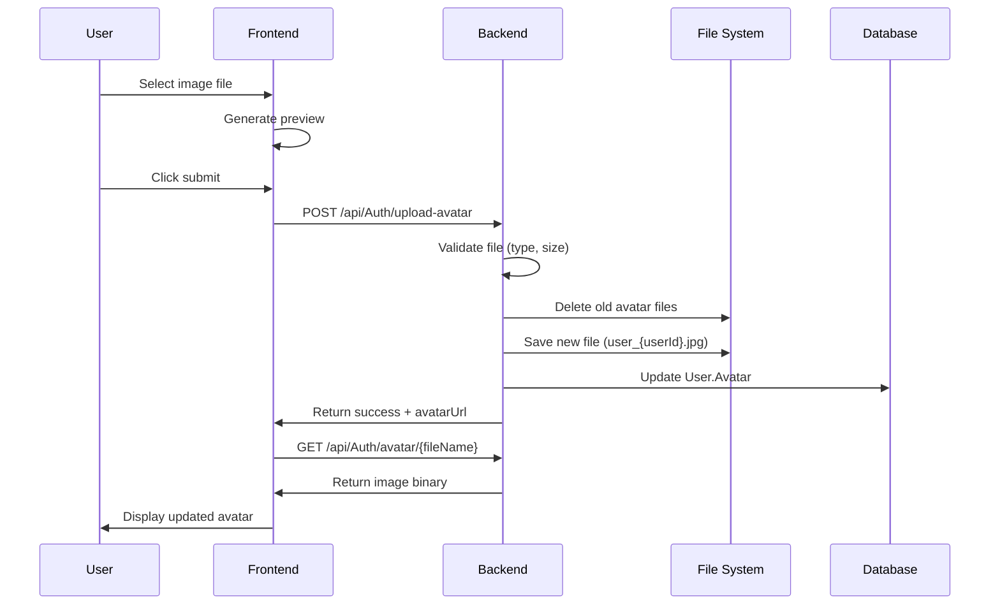

# 🖼️ Avatar Upload System - Context Document

## 📋 Tổng quan hệ thống

### 🎯 Mục đích
Hệ thống upload và quản lý avatar cho người dùng trong ứng dụng Event Management, đảm bảo:
- Upload ảnh từ máy tính
- Lưu trữ file avatar duy nhất cho mỗi user
- Hiển thị avatar đúng cách sau khi reload
- Không tích lũy file cũ

### 🏗️ Kiến trúc hệ thống

```
Frontend (React)          Backend (ASP.NET Core)         Database (SQL Server)
┌─────────────────┐      ┌─────────────────────────┐     ┌─────────────────┐
│ ProfilePage.jsx │─────▶│ AuthController.cs       │────▶│ User.Avatar     │
│ - File input    │      │ - UploadAvatar()        │     │ nvarchar(max)   │
│ - Preview       │      │ - GetAvatar()           │     │                 │
│ - Submit        │      │ - GetCurrentUserProfile │     │                 │
└─────────────────┘      └─────────────────────────┘     └─────────────────┘
                                │
                                ▼
                        ┌─────────────────┐
                        │ File System     │
                        │ wwwroot/uploads│
                        │ /avatars/      │
                        └─────────────────┘
```

## 🔧 Backend Implementation

### 📁 File Structure
```
src/
├── Controllers/
│   └── AuthController.cs          # Main controller
├── DTOs/
│   └── ProfileDTOs.cs             # Data transfer objects
├── Models/
│   └── User.cs                    # User entity
├── Services/
│   ├── AuthService.cs
│   └── IAuthService.cs
├── Repositories/
│   ├── UserRepository.cs
│   └── IUserRepository.cs
└── wwwroot/
    └── uploads/
        └── avatars/               # Avatar storage
```

### 🎮 API Endpoints

#### 1. Upload Avatar
```http
POST /api/Auth/upload-avatar
Content-Type: multipart/form-data
Authorization: Bearer {token}

Body: FormData with 'avatar' file
```

**Response:**
```json
{
  "message": "Upload avatar thành công",
  "avatarUrl": "/uploads/avatars/user_1.jpg",
  "fileName": "user_1.jpg"
}
```

#### 2. Get Avatar
```http
GET /api/Auth/avatar/{fileName}
```

**Response:** Binary image data

#### 3. Get Profile
```http
GET /api/Auth/profile
Authorization: Bearer {token}
```

**Response:**
```json
{
  "userId": 1,
  "username": "user1",
  "fullName": "John Doe",
  "email": "john@example.com",
  "avatar": "/uploads/avatars/user_1.jpg",
  "phone": "0123456789",
  "role": "User",
  "createdAt": "2024-01-01T00:00:00Z",
  "updatedAt": "2024-01-01T00:00:00Z",
  "dateOfBirth": "1990-01-01T00:00:00Z",
  "gender": "Male"
}
```

### 💾 Database Schema

#### User Table
```sql
CREATE TABLE [User] (
    [UserID] int IDENTITY(1,1) PRIMARY KEY,
    [Username] nvarchar(50) NOT NULL,
    [FullName] nvarchar(100) NOT NULL,
    [Email] nvarchar(100) NOT NULL,
    [PasswordHash] nvarchar(255) NOT NULL,
    [Phone] nvarchar(20),
    [Role] nvarchar(20) NOT NULL,
    [Avatar] nvarchar(max),           -- Relative path to avatar
    [DateOfBirth] datetime2,
    [Gender] nvarchar(10),
    [CreatedAt] datetime2 NOT NULL,
    [UpdatedAt] datetime2 NOT NULL
);
```

### 🔄 Upload Process Flow



## 🎨 Frontend Implementation

### 📱 ProfilePage Component

#### File Input UI
```jsx
<div>
  <input
    type="file"
    accept="image/*"
    onChange={handleAvatarChange}
    style={{ display: 'none' }}
    id="avatar-upload"
  />
  <label
    htmlFor="avatar-upload"
    style={{
      display: 'flex',
      flexDirection: 'column',
      alignItems: 'center',
      padding: '20px',
      border: '2px dashed #ccc',
      borderRadius: '8px',
      cursor: 'pointer',
      backgroundColor: '#f9f9f9'
    }}
  >
    <div style={{ fontSize: '1.5rem' }}>📷</div>
    <div>Chọn ảnh từ máy tính</div>
    <div style={{ fontSize: '0.75rem', color: '#9ca3af' }}>
      Hỗ trợ: JPG, PNG, GIF (tối đa 5MB)
    </div>
  </label>
</div>
```

#### Handle File Selection
```javascript
const handleAvatarChange = (e) => {
  const file = e.target.files[0];
  if (file) {
    // Validate file
    if (!file.type.startsWith('image/')) {
      alert('Vui lòng chọn file ảnh');
      return;
    }
    if (file.size > 5 * 1024 * 1024) {
      alert('File quá lớn (tối đa 5MB)');
      return;
    }
    
    setAvatarFile(file);
    
    // Generate preview
    const reader = new FileReader();
    reader.onload = (e) => {
      setAvatarPreview(e.target.result);
    };
    reader.readAsDataURL(file);
  }
};
```

#### Submit Handler
```javascript
const handleSubmit = async (e) => {
  e.preventDefault();
  
  try {
    let avatarUrl = profile.avatar; // Keep old avatar if no new upload
    
    // Upload new avatar if file selected
    if (avatarFile) {
      const uploadResult = await authAPI.uploadAvatar(avatarFile, token);
      avatarUrl = uploadResult.avatarUrl;
    }
    
    // Prepare update data
    const updateData = {
      fullName: formData.fullName,
      phone: formData.phone,
      dateOfBirth: formData.dateOfBirth,
      gender: formData.gender
    };
    
    // Only update avatar if new file was uploaded
    if (avatarFile && avatarUrl !== profile.avatar) {
      updateData.avatar = avatarUrl;
    }
    
    // Update profile
    await authAPI.updateProfile(updateData, token);
    
    // Refresh profile data
    const updatedProfile = await authAPI.getCurrentUserProfile(token);
    setProfile(updatedProfile);
    
    alert('Cập nhật profile thành công!');
  } catch (error) {
    console.error('Error updating profile:', error);
    alert('Có lỗi xảy ra khi cập nhật profile');
  }
};
```

### 🌐 API Service

#### Upload Avatar
```javascript
export const uploadAvatar = async (file, token) => {
  const formData = new FormData();
  formData.append('avatar', file);
  
  const response = await fetch(`${API_BASE_URL}/Auth/upload-avatar`, {
    method: 'POST',
    headers: {
      'Authorization': `Bearer ${token}`
    },
    body: formData
  });
  
  if (!response.ok) {
    throw new Error('Upload failed');
  }
  
  return await response.json();
};
```

#### Get Current User Profile
```javascript
export const getCurrentUserProfile = async (token) => {
  const response = await fetch(`${API_BASE_URL}/Auth/profile`, {
    headers: {
      'Authorization': `Bearer ${token}`,
      'Content-Type': 'application/json'
    }
  });
  
  if (!response.ok) {
    throw new Error('Failed to get profile');
  }
  
  const profile = await response.json();
  
  // Convert relative avatar URL to absolute URL
  if (profile.avatar && profile.avatar.startsWith('/')) {
    const fileName = profile.avatar.split('/').pop();
    profile.avatar = `${API_BASE_URL}/Auth/avatar/${fileName}`;
  }
  
  return profile;
};
```

## 🔧 Backend Core Logic

### 📤 Upload Avatar Method

```csharp
[HttpPost("upload-avatar")]
[Authorize]
public async Task<IActionResult> UploadAvatar(IFormFile avatar)
{
    try
    {
        // Validate file
        if (avatar == null || avatar.Length == 0)
            return BadRequest(new { message = "Không có file được chọn" });

        if (!avatar.ContentType.StartsWith("image/"))
            return BadRequest(new { message = "File phải là ảnh" });

        if (avatar.Length > 5 * 1024 * 1024) // 5MB
            return BadRequest(new { message = "File quá lớn (tối đa 5MB)" });

        var userId = GetUserIdFromToken();
        if (userId == null)
            return Unauthorized(new { message = "Token không hợp lệ" });

        // Create uploads directory if not exists
        var uploadsFolder = Path.Combine(Directory.GetCurrentDirectory(), "wwwroot", "uploads", "avatars");
        if (!Directory.Exists(uploadsFolder))
            Directory.CreateDirectory(uploadsFolder);

        // Delete old avatar files FIRST
        var oldFiles = Directory.GetFiles(uploadsFolder, $"user_{userId}.*");
        foreach (var oldFile in oldFiles)
        {
            try
            {
                System.IO.File.Delete(oldFile);
                Console.WriteLine($"Đã xóa file cũ: {oldFile}");
            }
            catch (Exception ex)
            {
                Console.WriteLine($"Không thể xóa file cũ {oldFile}: {ex.Message}");
            }
        }

        // Create fixed filename
        var fileExtension = Path.GetExtension(avatar.FileName);
        var fileName = $"user_{userId}{fileExtension}";
        var filePath = Path.Combine(uploadsFolder, fileName);

        // Save new file AFTER deleting old ones
        using (var stream = new FileStream(filePath, FileMode.Create))
        {
            await avatar.CopyToAsync(stream);
        }

        // Update database
        var avatarUrl = $"/uploads/avatars/{fileName}";
        var user = await _userRepository.GetUserByIdAsync(userId.Value);
        if (user != null)
        {
            user.Avatar = avatarUrl;
            user.UpdatedAt = DateTime.UtcNow;
            await _userRepository.UpdateUserAsync(user);
        }

        return Ok(new { 
            message = "Upload avatar thành công", 
            avatarUrl = avatarUrl,
            fileName = fileName
        });
    }
    catch (Exception ex)
    {
        return BadRequest(new { message = "Có lỗi xảy ra", error = ex.Message });
    }
}
```

### 🖼️ Get Avatar Method

```csharp
[HttpGet("avatar/{fileName}")]
public IActionResult GetAvatar(string fileName)
{
    try
    {
        var filePath = Path.Combine(Directory.GetCurrentDirectory(), "wwwroot", "uploads", "avatars", fileName);

        if (!System.IO.File.Exists(filePath))
            return NotFound(new { message = "Avatar not found" });

        var fileBytes = System.IO.File.ReadAllBytes(filePath);
        var contentType = GetContentType(fileName);

        return File(fileBytes, contentType);
    }
    catch (Exception ex)
    {
        return BadRequest(new { message = "Error serving avatar", error = ex.Message });
    }
}

private string GetContentType(string fileName)
{
    var extension = Path.GetExtension(fileName).ToLowerInvariant();
    return extension switch
    {
        ".jpg" or ".jpeg" => "image/jpeg",
        ".png" => "image/png",
        ".gif" => "image/gif",
        ".webp" => "image/webp",
        _ => "application/octet-stream"
    };
}
```

## 🛠️ Configuration

### 📁 Static Files (Program.cs)

```csharp
// Configure static files
app.UseStaticFiles();

// Configure CORS
app.UseCors(AppConstants.CORS_POLICY_NAME);

// Configure routing
app.MapControllers();
```

### 🔒 Authentication

```csharp
// JWT Authentication
builder.Services.AddAuthentication(JwtBearerDefaults.AuthenticationScheme)
    .AddJwtBearer(options =>
    {
        options.TokenValidationParameters = new TokenValidationParameters
        {
            ValidateIssuer = true,
            ValidateAudience = true,
            ValidateLifetime = true,
            ValidateIssuerSigningKey = true,
            ValidIssuer = builder.Configuration["Jwt:Issuer"],
            ValidAudience = builder.Configuration["Jwt:Audience"],
            IssuerSigningKey = new SymmetricSecurityKey(
                Encoding.UTF8.GetBytes(builder.Configuration["Jwt:Key"]))
        };
    });
```

## 🐛 Troubleshooting

### ❌ Common Issues

#### 1. Avatar không hiển thị sau reload
**Nguyên nhân:** Static files không được serve đúng cách
**Giải pháp:** 
- Kiểm tra `app.UseStaticFiles()` trong Program.cs
- Sử dụng API endpoint `/api/Auth/avatar/{fileName}` thay vì static files

#### 2. Nhiều file avatar được tạo
**Nguyên nhân:** Không xóa file cũ trước khi lưu file mới
**Giải pháp:** 
- Xóa file cũ trước: `Directory.GetFiles(uploadsFolder, $"user_{userId}.*")`
- Sử dụng tên file cố định: `user_{userId}.jpg`

#### 3. File không được lưu
**Nguyên nhân:** Thư mục không tồn tại hoặc không có quyền ghi
**Giải pháp:**
```csharp
if (!Directory.Exists(uploadsFolder))
    Directory.CreateDirectory(uploadsFolder);
```

### 🔍 Debug Logs

```csharp
// Add logging for debugging
Console.WriteLine($"Tìm file cũ: {oldFile}");
Console.WriteLine($"File cũ có tồn tại: {System.IO.File.Exists(oldFile)}");
Console.WriteLine($"Đã xóa file cũ: {oldFile}");
```

## 📊 File Naming Convention

### 🏷️ Avatar Files
```
uploads/avatars/
├── user_1.jpg      # User ID 1
├── user_2.png     # User ID 2  
├── user_3.gif     # User ID 3
└── user_4.webp    # User ID 4
```

### 📝 Database Storage
```sql
-- User.Avatar field stores relative path
UPDATE [User] SET [Avatar] = '/uploads/avatars/user_1.jpg' WHERE [UserID] = 1;
```

## 🚀 Performance Considerations

### 💾 File Size Limits
- Maximum file size: 5MB
- Supported formats: JPG, PNG, GIF, WebP
- Image compression: Consider adding image optimization

### 🔄 Caching
- Browser caching for avatar images
- Consider CDN for production
- Cache busting with timestamps (if needed)

### 🗂️ File Cleanup
- Automatic cleanup of orphaned files
- Regular maintenance of uploads folder
- Backup strategy for user avatars

## 📋 Testing Checklist

### ✅ Upload Functionality
- [ ] File validation (type, size)
- [ ] Preview generation
- [ ] Upload success response
- [ ] Database update
- [ ] File system storage

### ✅ Display Functionality  
- [ ] Avatar shows after upload
- [ ] Avatar persists after page reload
- [ ] Avatar updates when changed
- [ ] No duplicate files created

### ✅ Error Handling
- [ ] Invalid file type rejection
- [ ] File size limit enforcement
- [ ] Network error handling
- [ ] Authentication error handling

## 🔧 Development Commands

### 🏃‍♂️ Run Backend
```bash
cd src
dotnet run
```

### 🏃‍♂️ Run Frontend
```bash
cd ../TheGrind5_EventManagement_Frontend
npm start
```

### 🧹 Clean Uploads
```bash
# Remove all avatar files
rm -rf src/wwwroot/uploads/avatars/*
```

## 📚 Related Files

### Backend Files
- `src/Controllers/AuthController.cs` - Main controller
- `src/DTOs/ProfileDTOs.cs` - Data transfer objects
- `src/Models/User.cs` - User entity
- `src/Program.cs` - Application configuration

### Frontend Files
- `src/pages/ProfilePage.jsx` - Profile page component
- `src/services/api.js` - API service functions
- `src/contexts/AuthContext.js` - Authentication context

### Database Files
- `src/Migrations/` - Entity Framework migrations
- `AddUserProfileFields.sql` - Database schema updates

---

**📅 Last Updated:** January 2024  
**👨‍💻 Maintainer:** Development Team  
**🔗 Related Issues:** Avatar upload, File management, User profile

