# AUTHENTICATION & AUTHORIZATION CLASS DIAGRAM

## TỔNG QUAN
Class diagram này mô tả toàn bộ cụm chức năng Authentication & Authorization bao gồm:
- **Login** (Thiên)
- **Logout** (Thiên) 
- **Register** (Thiên)
- **Forgot Password** (Minh)
- **Change Password** (A.Duy)

---

## CLASS DIAGRAM

**Lưu ý về các ký hiệu relationship:**
- `<|..` = **Implementation** (Interface implementation)
- `-->` = **Association** (Sử dụng, dependency injection)
- `*--` = **Composition** (Sở hữu hoàn toàn, lifecycle phụ thuộc)
- `o--` = **Aggregation** (Sở hữu một phần, lifecycle độc lập)

```mermaid
classDiagram
    %% DTOs
    class LoginRequest {
        +string Email
        +string Password
    }
    
    class RegisterRequest {
        +string Username
        +string FullName
        +string Email
        +string Password
        +string Phone
    }
    
    class ForgotPasswordRequest {
        +string Email
    }
    
    class ChangePasswordRequest {
        +string CurrentPassword
        +string NewPassword
        +string ConfirmPassword
    }
    
    class LoginResponse {
        +string AccessToken
        +DateTime ExpiresAt
        +UserReadDto User
    }
    
    class RegisterResponse {
        +bool Success
        +string Message
        +UserReadDto User
    }
    
    class ForgotPasswordResponse {
        +bool Success
        +string Message
    }
    
    class ChangePasswordResponse {
        +bool Success
        +string Message
    }
    
    class UserReadDto {
        +int UserId
        +string Username
        +string FullName
        +string Email
        +string Phone
        +string Role
        +decimal WalletBalance
        +DateTime CreatedAt
    }
    
    %% Controllers
    class AuthController {
        +Login(LoginRequest request) IActionResult
        +Logout() IActionResult
        +Register(RegisterRequest request) IActionResult
        +ForgotPassword(ForgotPasswordRequest request) IActionResult
        +ChangePassword(ChangePasswordRequest request) IActionResult
    }
    
    %% Services Interfaces
    class IAuthService {
        <<interface>>
        +LoginAsync(string email, string password) LoginResponse?
        +LogoutAsync(string token) bool
        +RegisterAsync(RegisterRequest request) RegisterResponse
        +ForgotPasswordAsync(string email) ForgotPasswordResponse
        +ChangePasswordAsync(int userId, string currentPassword, string newPassword) ChangePasswordResponse
    }
    
    class IJwtService {
        <<interface>>
        +GenerateToken(User user) string
        +ValidateToken(string token) bool
        +GetUserIdFromToken(string token) int?
        +RevokeToken(string token) bool
    }
    
    class IPasswordService {
        <<interface>>
        +HashPassword(string password) string
        +VerifyPassword(string password, string hash) bool
    }
    
    class IEmailService {
        <<interface>>
        +SendEmailAsync(string to, string subject, string body) bool
        +SendOtpEmailAsync(string to, string otpCode) bool
        +SendPasswordResetEmailAsync(string to, string resetLink) bool
    }
    
    class IOtpService {
        <<interface>>
        +GenerateOtpAsync(string email) string
        +ValidateOtpAsync(string email, string otpCode) bool
        +ExpireOtpAsync(string email) bool
    }
    
    class IUserRepository {
        <<interface>>
        +GetUserByEmailAsync(string email) User?
        +GetUserByIdAsync(int userId) User?
        +CreateUserAsync(User user) User
        +UpdateUserAsync(User user) User
        +GetUserByUsernameAsync(string username) User?
        +CheckEmailExistsAsync(string email) bool
        +CheckUsernameExistsAsync(string username) bool
    }
    
    class IUserMapper {
        <<interface>>
        +ToUserReadDto(User user) UserReadDto
        +ToUser(RegisterRequest request) User
    }
    
    %% Services Implementations
    class AuthService {
        +LoginAsync(string email, string password) LoginResponse?
        +LogoutAsync(string token) bool
        +RegisterAsync(RegisterRequest request) RegisterResponse
        +ForgotPasswordAsync(string email) ForgotPasswordResponse
        +ChangePasswordAsync(int userId, string currentPassword, string newPassword) ChangePasswordResponse
    }
    
    class JwtService {
        +GenerateToken(User user) string
        +ValidateToken(string token) bool
        +GetUserIdFromToken(string token) int?
        +RevokeToken(string token) bool
    }
    
    class PasswordService {
        +HashPassword(string password) string
        +VerifyPassword(string password, string hash) bool
    }
    
    class EmailService {
        +SendEmailAsync(string to, string subject, string body) bool
        +SendOtpEmailAsync(string to, string otpCode) bool
        +SendPasswordResetEmailAsync(string to, string resetLink) bool
    }
    
    class OtpService {
        +GenerateOtpAsync(string email) string
        +ValidateOtpAsync(string email, string otpCode) bool
        +ExpireOtpAsync(string email) bool
    }
    
    class UserRepository {
        +GetUserByEmailAsync(string email) User?
        +GetUserByIdAsync(int userId) User?
        +CreateUserAsync(User user) User
        +UpdateUserAsync(User user) User
        +GetUserByUsernameAsync(string username) User?
        +CheckEmailExistsAsync(string email) bool
        +CheckUsernameExistsAsync(string username) bool
    }
    
    class UserMapper {
        +ToUserReadDto(User user) UserReadDto
        +ToUser(RegisterRequest request) User
    }
    
    %% Data Models
    class User {
        +int UserId
        +string Username
        +string FullName
        +string Email
        +string PasswordHash
        +string Phone
        +string Role
        +decimal WalletBalance
        +DateTime CreatedAt
        +DateTime? UpdatedAt
        +bool IsActive
    }
    
    class OtpCode {
        +int Id
        +string Email
        +string Code
        +DateTime CreatedAt
        +DateTime ExpiresAt
        +bool IsUsed
    }
    
    class EventDBContext {
        +DbSet~User~ Users
        +DbSet~OtpCode~ OtpCodes
        +OnModelCreating(ModelBuilder modelBuilder)
        +SaveChangesAsync() int
    }
    
    %% Relationships - Implementation
    IAuthService <|.. AuthService : implements
    IJwtService <|.. JwtService : implements
    IPasswordService <|.. PasswordService : implements
    IEmailService <|.. EmailService : implements
    IOtpService <|.. OtpService : implements
    IUserRepository <|.. UserRepository : implements
    IUserMapper <|.. UserMapper : implements
    
    %% Relationships - Association (sử dụng)
    AuthController --> IAuthService : uses
    AuthController --> IUserRepository : uses
    AuthController --> IEmailService : uses
    AuthController --> IOtpService : uses
    
    AuthService --> IUserRepository : uses
    AuthService --> IJwtService : uses
    AuthService --> IPasswordService : uses
    AuthService --> IUserMapper : uses
    AuthService --> IEmailService : uses
    AuthService --> IOtpService : uses
    
    UserRepository --> EventDBContext : uses
    
    %% Relationships - Composition (sở hữu hoàn toàn)
    EventDBContext *-- User : contains
    EventDBContext *-- OtpCode : contains
    
    LoginResponse *-- UserReadDto : contains
    RegisterResponse *-- UserReadDto : contains
    
    %% Relationships - Aggregation (sở hữu một phần)
    AuthController o-- LoginRequest : handles
    AuthController o-- RegisterRequest : handles
    AuthController o-- ForgotPasswordRequest : handles
    AuthController o-- ChangePasswordRequest : handles
    
    AuthController o-- LoginResponse : returns
    AuthController o-- RegisterResponse : returns
    AuthController o-- ForgotPasswordResponse : returns
    AuthController o-- ChangePasswordResponse : returns
    
    AuthService o-- LoginResponse : creates
    AuthService o-- RegisterResponse : creates
    AuthService o-- ForgotPasswordResponse : creates
    AuthService o-- ChangePasswordResponse : creates
    
    UserMapper o-- UserReadDto : creates
    UserMapper o-- User : creates
```

---

## LUỒNG TƯƠNG TÁC CHI TIẾT

### 1. LOGIN FLOW
1. **AuthController** nhận `LoginRequest`
2. **AuthController** gọi `AuthService.LoginAsync()`
3. **AuthService** sử dụng `UserRepository` để tìm user
4. **AuthService** sử dụng `PasswordService` để verify password
5. **AuthService** sử dụng `JwtService` để tạo token
6. **AuthService** sử dụng `UserMapper` để tạo `UserReadDto`
7. Trả về `LoginResponse` với token và user info

### 2. REGISTER FLOW
1. **AuthController** nhận `RegisterRequest`
2. **AuthController** gọi `AuthService.RegisterAsync()`
3. **AuthService** kiểm tra email/username đã tồn tại
4. **AuthService** sử dụng `PasswordService` để hash password
5. **AuthService** sử dụng `UserRepository` để tạo user mới
6. **AuthService** sử dụng `UserMapper` để tạo `UserReadDto`
7. Trả về `RegisterResponse`

### 3. FORGOT PASSWORD FLOW
1. **AuthController** nhận `ForgotPasswordRequest`
2. **AuthController** gọi `AuthService.ForgotPasswordAsync()`
3. **AuthService** kiểm tra email tồn tại
4. **AuthService** sử dụng `OtpService` để tạo OTP
5. **AuthService** sử dụng `EmailService` để gửi OTP
6. Trả về `ForgotPasswordResponse`

### 4. CHANGE PASSWORD FLOW
1. **AuthController** nhận `ChangePasswordRequest`
2. **AuthController** gọi `AuthService.ChangePasswordAsync()`
3. **AuthService** sử dụng `UserRepository` để lấy user
4. **AuthService** sử dụng `PasswordService` để verify current password
5. **AuthService** sử dụng `PasswordService` để hash new password
6. **AuthService** sử dụng `UserRepository` để update user
7. Trả về `ChangePasswordResponse`

### 5. LOGOUT FLOW
1. **AuthController** nhận logout request
2. **AuthController** gọi `AuthService.LogoutAsync()`
3. **AuthService** sử dụng `JwtService` để revoke token
4. Trả về logout confirmation

---

## CÁC THÀNH PHẦN CHÍNH

### Controllers
- **AuthController**: Điểm tiếp nhận tất cả requests liên quan đến authentication

### Services
- **AuthService**: Logic nghiệp vụ chính cho authentication
- **JwtService**: Quản lý JWT tokens
- **PasswordService**: Hash và verify passwords
- **EmailService**: Gửi emails (OTP, password reset)
- **OtpService**: Quản lý OTP codes

### Repositories
- **UserRepository**: Tương tác với database cho User entities

### Mappers
- **UserMapper**: Chuyển đổi giữa User entity và DTOs

### Data Models
- **User**: Entity chính cho user data
- **OtpCode**: Entity cho OTP management
- **EventDBContext**: Database context

### DTOs
- **Request DTOs**: LoginRequest, RegisterRequest, ForgotPasswordRequest, ChangePasswordRequest
- **Response DTOs**: LoginResponse, RegisterResponse, ForgotPasswordResponse, ChangePasswordResponse
- **UserReadDto**: DTO cho user information

---

## LỢI ÍCH CỦA KIẾN TRÚC NÀY

1. **Separation of Concerns**: Mỗi lớp có trách nhiệm riêng biệt
2. **Dependency Injection**: Dễ dàng test và maintain
3. **Interface-based**: Linh hoạt trong việc thay đổi implementation
4. **Scalable**: Dễ dàng thêm tính năng mới
5. **Security**: Tách biệt logic xử lý password và JWT
6. **Reusable**: Các service có thể được sử dụng ở nhiều nơi khác nhau
