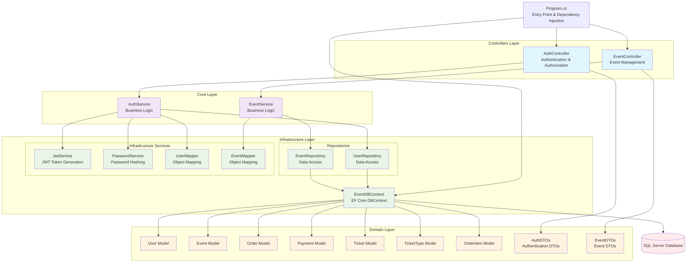
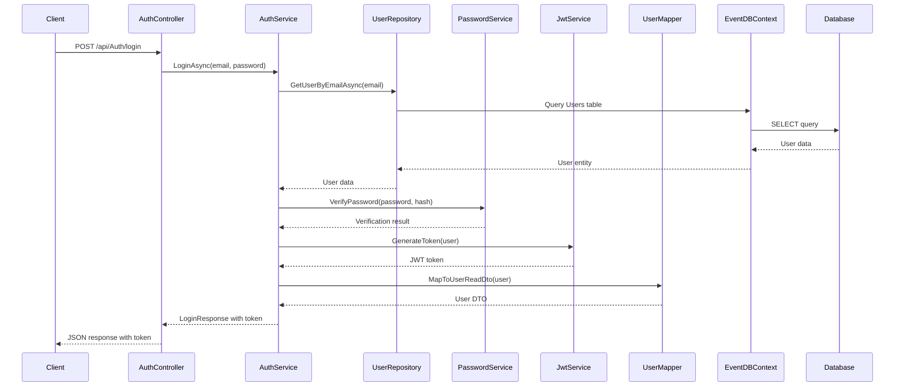
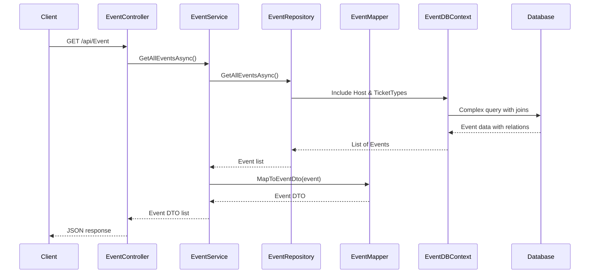

# Sơ đồ Kiến trúc Backend - TheGrind5 Event Management

## Tổng quan
Backend được xây dựng bằng ASP.NET Core với kiến trúc Clean Architecture, sử dụng Entity Framework Core cho data access và được tổ chức theo nguyên tắc Separation of Concerns.

## Sơ đồ Kiến trúc Backend (Clean Architecture)

## Luồng Xử lý Chính

### 1. Authentication Flow (Clean Architecture)

### 2. Event Management Flow (Clean Architecture)

## Các Layer và Trách nhiệm (Clean Architecture)

### 1. Presentation Layer (Controllers)
- **AuthController**: Chỉ xử lý HTTP requests/responses, không có business logic
- **EventController**: Chỉ xử lý HTTP requests/responses, không có business logic

### 2. Core Layer (Business Logic)
- **AuthService**: Business logic cho authentication, gọi các Infrastructure services
- **EventService**: Business logic cho event management, gọi Repository và Mapper

### 3. Infrastructure Layer
#### **Repositories (Data Access)**
- **UserRepository**: Data access cho User entity
- **EventRepository**: Data access cho Event entity

#### **Infrastructure Services**
- **JwtService**: JWT token generation và validation
- **PasswordService**: Password hashing và verification
- **UserMapper**: Object mapping cho User entities
- **EventMapper**: Object mapping cho Event entities

#### **Data Layer**
- **EventDBContext**: EF Core DbContext cho tất cả entities

### 4. Domain Layer (Models & DTOs)
- **User, Event, Order, Payment, Ticket, TicketType, OrderItem**: Domain entities
- **AuthDTOs, EventDTOs**: Data Transfer Objects

## Cấu hình và Dependencies

### Program.cs Configuration (Clean Architecture)
- **Repository Layer**: IUserRepository, IEventRepository
- **Infrastructure Services**: IJwtService, IPasswordService, IUserMapper, IEventMapper
- **Core Services**: AuthService, EventService
- **CORS configuration** cho frontend
- **Swagger/OpenAPI documentation**
- **Database connection string**
- **JWT authentication setup**

### Database Relationships
- User → Events (One-to-Many)
- Event → TicketTypes (One-to-Many)
- Order → OrderItems (One-to-Many)
- TicketType → Tickets (One-to-Many)
- Order → Payment (One-to-One)

## Security Features (Clean Architecture)
- **JWT Token authentication** (JwtService)
- **BCrypt password hashing** (PasswordService)
- **CORS policy configuration**
- **Input validation**
- **Authorization attributes**
- **Separation of concerns** - Security logic tách biệt trong Infrastructure layer

## API Endpoints

### Authentication
- `POST /api/Auth/login` - Đăng nhập
- `POST /api/Auth/register` - Đăng ký
- `GET /api/Auth/me` - Lấy thông tin user hiện tại
- `GET /api/Auth/user/{userId}` - Lấy thông tin user theo ID

### Events
- `GET /api/Event` - Lấy tất cả events
- `GET /api/Event/{id}` - Lấy event theo ID
- `POST /api/Event` - Tạo event mới (cần authentication)
- `PUT /api/Event/{id}` - Cập nhật event (cần authentication)
- `DELETE /api/Event/{id}` - Xóa event (cần authentication)
- `GET /api/Event/host/{hostId}` - Lấy events theo host
