# Sơ Đồ Nghiệp Vụ - Luồng Đặt Vé Sự Kiện

## Mô tả
Sơ đồ này mô tả luồng nghiệp vụ từ khi user xem chi tiết sự kiện đến khi hoàn thành đơn hàng và nhận vé.

## Sơ Đồ Luồng Nghiệp Vụ

```mermaid
flowchart TD
    A[🏠 User truy cập trang chủ] --> B[📋 Xem danh sách sự kiện]
    B --> C[👀 Chọn sự kiện quan tâm]
    C --> D[📄 Xem chi tiết sự kiện]
    
    D --> E{🎫 Event có sẵn vé không?}
    E -->|❌ Không| F[⚠️ Hiển thị thông báo: Hết vé]
    E -->|✅ Có| G[🎟️ Xem các loại vé có sẵn]
    
    G --> H[🛒 Chọn loại vé và số lượng]
    H --> I{🔍 Kiểm tra số lượng vé còn lại}
    
    I -->|❌ Không đủ| J[⚠️ Thông báo: Không đủ vé]
    I -->|✅ Đủ| K[📦 Thêm vào giỏ hàng]
    
    K --> L{🔐 User đã đăng nhập?}
    L -->|❌ Chưa| M[🔑 Chuyển đến trang đăng nhập]
    M --> N[✅ Đăng nhập thành công]
    N --> O[🔄 Quay lại giỏ hàng]
    L -->|✅ Đã đăng nhập| O
    
    O --> P[👀 Xem lại đơn hàng]
    P --> Q[✅ Xác nhận thông tin đặt vé]
    Q --> R[📝 Tạo đơn hàng<br/>Status: Pending]
    
    R --> S[💳 Chuyển đến trang thanh toán]
    S --> T[🏦 Chọn phương thức thanh toán]
    T --> U[💰 Thực hiện thanh toán]
    
    U --> V{💸 Thanh toán thành công?}
    V -->|❌ Thất bại| W[❌ Cập nhật Order Status: Failed]
    W --> X[⚠️ Thông báo lỗi thanh toán]
    X --> Y[🔄 Quay lại trang thanh toán]
    
    V -->|✅ Thành công| Z[✅ Cập nhật Order Status: Paid]
    Z --> AA[📊 Tạo Payment record]
    AA --> BB[🎫 Tạo vé cho từng OrderItem]
    BB --> CC[🔢 Generate Serial Number cho vé]
    CC --> DD[📌 Cập nhật Ticket Status: Assigned]
    DD --> EE[📧 Gửi email xác nhận]
    EE --> FF[🎉 Hiển thị thông báo thành công]
    
    FF --> GG[🎫 User xem vé trong My Tickets]
    GG --> HH[🏟️ User có thể check-in tại sự kiện]
    HH --> II[📱 Scan QR code vé]
    II --> JJ{🔍 Kiểm tra vé hợp lệ?}
    JJ -->|❌ Không| KK[⚠️ Thông báo vé không hợp lệ]
    JJ -->|✅ Có| LL[✅ Cập nhật Ticket Status: Used]
    LL --> MM[⏰ Ghi nhận thời gian sử dụng]
    MM --> NN[🎊 Hoàn thành quá trình]
    
    style A fill:#e3f2fd,stroke:#1976d2,stroke-width:2px
    style NN fill:#e8f5e8,stroke:#4caf50,stroke-width:3px
    style F fill:#ffebee,stroke:#f44336,stroke-width:2px
    style J fill:#ffebee,stroke:#f44336,stroke-width:2px
    style W fill:#ffebee,stroke:#f44336,stroke-width:2px
    style X fill:#ffebee,stroke:#f44336,stroke-width:2px
    style KK fill:#ffebee,stroke:#f44336,stroke-width:2px
    style E fill:#fff3e0,stroke:#ff9800,stroke-width:2px
    style I fill:#fff3e0,stroke:#ff9800,stroke-width:2px
    style L fill:#fff3e0,stroke:#ff9800,stroke-width:2px
    style V fill:#fff3e0,stroke:#ff9800,stroke-width:2px
    style JJ fill:#fff3e0,stroke:#ff9800,stroke-width:2px
```

## Chi Tiết Các Bước

### 1. Xem Sự Kiện
- User truy cập trang chủ
- Xem danh sách các sự kiện đang mở bán
- Chọn sự kiện để xem chi tiết

### 2. Chọn Vé
- Xem thông tin chi tiết sự kiện (thời gian, địa điểm, mô tả)
- Xem các loại vé có sẵn (VIP, Standard, Student...)
- Chọn loại vé và số lượng muốn mua
- Kiểm tra tính khả dụng của vé

### 3. Xác Thực User
- Kiểm tra trạng thái đăng nhập
- Nếu chưa đăng nhập, chuyển hướng đến trang login
- Sau khi đăng nhập, quay lại quá trình đặt vé

### 4. Tạo Đơn Hàng
- Tạo Order với status "Pending"
- Tính toán tổng tiền dựa trên giá vé và số lượng
- Lưu thông tin OrderItem (loại vé, số lượng, ghế...)

### 5. Thanh Toán
- Chuyển đến trang thanh toán
- Chọn phương thức thanh toán (Ví điện tử, Thẻ, Chuyển khoản...)
- Thực hiện giao dịch thanh toán

### 6. Xử Lý Kết Quả Thanh Toán

#### Nếu Thành Công:
- Cập nhật Order status thành "Paid"
- Tạo Payment record
- Tạo vé cho từng OrderItem
- Generate serial number duy nhất cho mỗi vé
- Cập nhật Ticket status thành "Assigned"
- Gửi email xác nhận cho user
- Hiển thị thông báo thành công

#### Nếu Thất Bại:
- Cập nhật Order status thành "Failed"
- Hiển thị thông báo lỗi
- Cho phép user thử lại thanh toán

### 7. Quản Lý Vé
- User có thể xem vé trong "My Tickets"
- Vé có trạng thái "Assigned" (đã được gán)
- Mỗi vé có serial number duy nhất

### 8. Check-in Tại Sự Kiện
- User đến sự kiện và scan QR code
- Hệ thống kiểm tra tính hợp lệ của vé
- Nếu hợp lệ: cập nhật status thành "Used"
- Ghi nhận thời gian sử dụng vé

## Các Trạng Thái Quan Trọng

### Order Status:
- **Pending**: Đơn hàng đã tạo, chờ thanh toán
- **Paid**: Đã thanh toán thành công
- **Failed**: Thanh toán thất bại
- **Cancelled**: Đơn hàng bị hủy
- **Refunded**: Đã hoàn tiền

### Ticket Status:
- **Available**: Vé có sẵn để bán
- **Assigned**: Vé đã được gán cho user
- **Used**: Vé đã được sử dụng tại sự kiện
- **Refunded**: Vé đã được hoàn tiền

### Payment Status:
- **Initiated**: Bắt đầu thanh toán
- **Succeeded**: Thanh toán thành công
- **Failed**: Thanh toán thất bại
- **Refunded**: Đã hoàn tiền

## Các Điểm Kiểm Tra Quan Trọng

1. **Kiểm tra tính khả dụng của vé** trước khi cho phép đặt
2. **Xác thực user** trước khi tạo đơn hàng
3. **Kiểm tra số dư ví** trước khi thanh toán
4. **Validate vé** trước khi check-in
5. **Kiểm tra thời gian sự kiện** khi check-in

## Xử Lý Lỗi

- **Hết vé**: Thông báo và không cho phép đặt
- **Thanh toán thất bại**: Cho phép thử lại hoặc hủy đơn
- **Vé không hợp lệ**: Thông báo lỗi và không cho check-in
- **Sự kiện đã kết thúc**: Không cho phép check-in

## Tích Hợp Với Hệ Thống Khác

- **Email Service**: Gửi xác nhận đơn hàng và vé
- **Payment Gateway**: Xử lý thanh toán
- **QR Code Generator**: Tạo mã QR cho vé
- **Notification Service**: Thông báo trạng thái đơn hàng
