# 🏗️ BACKEND CLASS DIAGRAM - THEGRIND5 EVENT MANAGEMENT

## 📊 **CLASS DIAGRAM - QUAN HỆ GIỮA CÁC LỚP**

```mermaid
classDiagram
    %% ===== CONTROLLERS LAYER =====
    class AuthController {
        -IAuthService _authService
        -IUserRepository _userRepository
        +Login(request) IActionResult
        +Register(request) IActionResult
        +GetCurrentUser() IActionResult
        +GetUserById(userId) IActionResult
        +GetMyWallet() IActionResult
        +GetWalletBalance() IActionResult
        +SeedAdmin() IActionResult
        -HashPassword(password) string
        -IsValidLoginRequest(request) bool
        -GetUserIdFromToken() int
        -CreateUserDto(user) object
        -CreateLoginResponse(result) object
        -CreateRegisterResponse(result) object
    }

    class EventController {
        -IEventService _eventService
        +GetAllEvents() IActionResult
        +GetEventById(id) IActionResult
        +CreateEvent(request) IActionResult
        +UpdateEvent(id, request) IActionResult
        +DeleteEvent(id) IActionResult
        +GetEventsByHost(hostId) IActionResult
        +SeedSampleEvents() IActionResult
        -GetUserIdFromToken() int
    }

    class OrderController {
        -IOrderService _orderService
        -IWalletService _walletService
        +CreateOrder(request) IActionResult
        +GetOrderById(id) IActionResult
        +GetUserOrders(userId) IActionResult
        +GetMyOrders() IActionResult
        +UpdateOrderStatus(id, request) IActionResult
        +CancelOrder(id) IActionResult
        +ProcessPayment(id, request) IActionResult
        -IsValidCreateOrderRequest(request) bool
        -GetUserIdFromToken() int
    }

    class WalletController {
        -IWalletService _walletService
        +GetWalletBalance() IActionResult
        +Deposit(request) IActionResult
        +Withdraw(request) IActionResult
        +GetTransactions(page, pageSize) IActionResult
        +GetTransaction(transactionId) IActionResult
        +CheckSufficientBalance(amount) IActionResult
        -GetUserIdFromToken() int
    }

    %% ===== SERVICES LAYER =====
    class IAuthService {
        <<interface>>
        +LoginAsync(email, password) Task
        +RegisterAsync(request) Task
    }

    class AuthService {
        -IUserRepository _userRepository
        -IJwtService _jwtService
        -IPasswordService _passwordService
        -IUserMapper _userMapper
        +LoginAsync(email, password) Task
        +RegisterAsync(request) Task
    }

    class IEventService {
        <<interface>>
        +GetAllEventsAsync() Task
        +GetEventByIdAsync(id) Task
        +CreateEventAsync(eventData) Task
        +UpdateEventAsync(id, eventData) Task
        +DeleteEventAsync(id) Task
        +GetEventsByHostAsync(hostId) Task
        +MapToEventDto(eventData) EventDto
        +MapToEventDetailDto(eventData) EventDetailDto
        +MapFromCreateEventRequest(request, hostId) Event
    }

    class EventService {
        -IEventRepository _eventRepository
        -IEventMapper _eventMapper
        +GetAllEventsAsync() Task
        +GetEventByIdAsync(id) Task
        +CreateEventAsync(eventData) Task
        +UpdateEventAsync(id, eventData) Task
        +DeleteEventAsync(id) Task
        +GetEventsByHostAsync(hostId) Task
        +MapToEventDto(eventData) EventDto
        +MapToEventDetailDto(eventData) EventDetailDto
        +MapFromCreateEventRequest(request, hostId) Event
    }

    class IOrderService {
        <<interface>>
        +CreateOrderAsync(request, userId) Task
        +GetOrderByIdAsync(orderId) Task
        +GetUserOrdersAsync(userId) Task
        +UpdateOrderStatusAsync(orderId, status) Task
    }

    class OrderService {
        -IOrderRepository _orderRepository
        -IOrderMapper _orderMapper
        +CreateOrderAsync(request, userId) Task
        +GetOrderByIdAsync(orderId) Task
        +GetUserOrdersAsync(userId) Task
        +UpdateOrderStatusAsync(orderId, status) Task
    }

    class IWalletService {
        <<interface>>
        +GetWalletBalanceAsync(userId) Task
        +UpdateWalletBalanceAsync(userId, newBalance) Task
        +CreateTransactionAsync(transaction) Task
        +GetTransactionByIdAsync(transactionId) Task
        +GetUserTransactionsAsync(userId, page, pageSize) Task
        +DepositAsync(userId, amount, description, referenceId) Task
        +WithdrawAsync(userId, amount, description, referenceId) Task
        +ProcessPaymentAsync(userId, amount, orderId, description) Task
        +ProcessRefundAsync(userId, amount, orderId, description) Task
        +HasSufficientBalanceAsync(userId, amount) Task
        +ValidateTransactionAsync(transaction) Task
    }

    class WalletService {
        -EventDBContext _context
        -IUserRepository _userRepository
        +GetWalletBalanceAsync(userId) Task
        +UpdateWalletBalanceAsync(userId, newBalance) Task
        +CreateTransactionAsync(transaction) Task
        +GetTransactionByIdAsync(transactionId) Task
        +GetUserTransactionsAsync(userId, page, pageSize) Task
        +DepositAsync(userId, amount, description, referenceId) Task
        +WithdrawAsync(userId, amount, description, referenceId) Task
        +ProcessPaymentAsync(userId, amount, orderId, description) Task
        +ProcessRefundAsync(userId, amount, orderId, description) Task
        +HasSufficientBalanceAsync(userId, amount) Task
        +ValidateTransactionAsync(transaction) Task
    }

    %% ===== UTILITY SERVICES =====
    class IJwtService {
        <<interface>>
        +GenerateToken(user) string
        +GenerateToken(user, expiresAt) string
    }

    class JwtService {
        -IConfiguration _configuration
        +GenerateToken(user) string
        +GenerateToken(user, expiresAt) string
        -GetJwtConfiguration() tuple
        -CreateSigningCredentials(key) SigningCredentials
        -CreateUserClaims(user) ClaimArray
    }

    class IPasswordService {
        <<interface>>
        +HashPassword(password) string
        +VerifyPassword(password, hash) bool
    }

    class PasswordService {
        +HashPassword(password) string
        +VerifyPassword(password, hash) bool
    }

    %% ===== REPOSITORIES LAYER =====
    class IUserRepository {
        <<interface>>
        +GetUserByIdAsync(userId) Task
        +GetUserByEmailAsync(email) Task
        +CreateUserAsync(user) Task
        +UpdateUserAsync(user) Task
        +DeleteUserAsync(userId) Task
        +IsEmailExistsAsync(email) Task
        +UpdateWalletBalanceAsync(userId, newBalance) Task
        +GetWalletBalanceAsync(userId) Task
    }

    class UserRepository {
        -EventDBContext _context
        +GetUserByIdAsync(userId) Task
        +GetUserByEmailAsync(email) Task
        +CreateUserAsync(user) Task
        +UpdateUserAsync(user) Task
        +DeleteUserAsync(userId) Task
        +IsEmailExistsAsync(email) Task
        +UpdateWalletBalanceAsync(userId, newBalance) Task
        +GetWalletBalanceAsync(userId) Task
    }

    class IEventRepository {
        <<interface>>
        +GetAllEventsAsync() Task
        +GetEventByIdAsync(eventId) Task
        +GetEventsByHostAsync(hostId) Task
        +CreateEventAsync(eventData) Task
        +UpdateEventAsync(eventId, eventData) Task
        +DeleteEventAsync(eventId) Task
    }

    class EventRepository {
        -EventDBContext _context
        +GetAllEventsAsync() Task
        +GetEventByIdAsync(eventId) Task
        +GetEventsByHostAsync(hostId) Task
        +CreateEventAsync(eventData) Task
        +UpdateEventAsync(eventId, eventData) Task
        +DeleteEventAsync(eventId) Task
    }

    class IOrderRepository {
        <<interface>>
        +GetOrderByIdAsync(orderId) Task
        +GetOrdersByUserIdAsync(userId) Task
        +CreateOrderAsync(order) Task
        +UpdateOrderAsync(order) Task
        +DeleteOrderAsync(orderId) Task
    }

    class OrderRepository {
        -EventDBContext _context
        +GetOrderByIdAsync(orderId) Task
        +GetOrdersByUserIdAsync(userId) Task
        +CreateOrderAsync(order) Task
        +UpdateOrderAsync(order) Task
        +DeleteOrderAsync(orderId) Task
    }

    %% ===== MAPPERS LAYER =====
    class IUserMapper {
        <<interface>>
        +MapToUserReadDto(user) UserReadDto
        +MapFromRegisterRequest(request, passwordHash) User
    }

    class UserMapper {
        +MapToUserReadDto(user) UserReadDto
        +MapFromRegisterRequest(request, passwordHash) User
    }

    class IEventMapper {
        <<interface>>
        +MapToEventDto(eventData) EventDto
        +MapToEventDetailDto(eventData) EventDetailDto
        +MapFromCreateEventRequest(request, hostId) Event
    }

    class EventMapper {
        +MapToEventDto(eventData) EventDto
        +MapToEventDetailDto(eventData) EventDetailDto
        +MapFromCreateEventRequest(request, hostId) Event
    }

    class IOrderMapper {
        <<interface>>
        +MapToOrderDto(order) OrderDTO
        +MapToCreateOrderResponseDto(order, event, ticketType) CreateOrderResponseDTO
        +MapFromCreateOrderRequest(request, userId) Order
    }

    class OrderMapper {
        +MapToOrderDto(order) OrderDTO
        +MapToCreateOrderResponseDto(order, event, ticketType) CreateOrderResponseDTO
        +MapFromCreateOrderRequest(request, userId) Order
    }

    %% ===== MODELS LAYER =====
    class User {
        +int UserId
        +string Username
        +string FullName
        +string Email
        +string PasswordHash
        +string Phone
        +string Role
        +DateTime CreatedAt
        +DateTime UpdatedAt
        +decimal WalletBalance
        +ICollection Events
        +ICollection Orders
        +ICollection WalletTransactions
    }

    class Event {
        +int EventId
        +int HostId
        +string Title
        +string Description
        +DateTime StartTime
        +DateTime EndTime
        +string Location
        +string Category
        +string Status
        +DateTime CreatedAt
        +DateTime UpdatedAt
        +User Host
        +ICollection TicketTypes
    }

    class Order {
        +int OrderId
        +int CustomerId
        +decimal Amount
        +string Status
        +string PaymentMethod
        +DateTime CreatedAt
        +DateTime UpdatedAt
        +User Customer
        +ICollection OrderItems
        +ICollection Payments
    }

    class OrderItem {
        +int OrderItemId
        +int OrderId
        +int TicketTypeId
        +int Quantity
        +string SeatNo
        +string Status
        +Order Order
        +TicketType TicketType
        +ICollection Tickets
    }

    class Payment {
        +int PaymentId
        +int OrderId
        +decimal Amount
        +string Method
        +string Status
        +DateTime PaymentDate
        +Order Order
    }

    class Ticket {
        +int TicketId
        +int TicketTypeId
        +int OrderItemId
        +string SerialNumber
        +string Status
        +DateTime IssuedAt
        +DateTime UsedAt
        +DateTime RefundedAt
        +OrderItem OrderItem
        +TicketType TicketType
    }

    class TicketType {
        +int TicketTypeId
        +int EventId
        +string TypeName
        +decimal Price
        +int Quantity
        +int MinOrder
        +int MaxOrder
        +DateTime SaleStart
        +DateTime SaleEnd
        +string Status
        +Event Event
        +ICollection OrderItems
        +ICollection Tickets
    }

    class WalletTransaction {
        +int TransactionId
        +int UserId
        +decimal Amount
        +string TransactionType
        +string Status
        +string Description
        +string ReferenceId
        +DateTime CreatedAt
        +DateTime CompletedAt
        +decimal BalanceBefore
        +decimal BalanceAfter
        +User User
    }

    %% ===== DTOs LAYER =====
    class LoginRequest {
        +string Email
        +string Password
    }

    class RegisterRequest {
        +string Username
        +string Email
        +string Password
        +string FullName
        +string Phone
    }

    class UserReadDto {
        +int UserId
        +string FullName
        +string Email
        +string Phone
        +string Role
        +decimal WalletBalance
    }

    class LoginResponse {
        +string AccessToken
        +DateTime ExpiresAt
        +UserReadDto User
    }

    class CreateEventRequest {
        +string Title
        +string Description
        +DateTime StartTime
        +DateTime EndTime
        +string Location
        +string Category
    }

    class CreateOrderRequestDTO {
        +int EventId
        +int TicketTypeId
        +int Quantity
        +string SeatNo
    }

    class DepositRequest {
        +decimal Amount
        +string Description
    }

    class WithdrawRequest {
        +decimal Amount
        +string Description
    }

    class WalletBalanceResponse {
        +decimal Balance
        +string Currency
        +DateTime LastUpdated
    }

    %% ===== DATA LAYER =====
    class EventDBContext {
        +DbSet Events
        +DbSet Orders
        +DbSet OrderItems
        +DbSet Payments
        +DbSet Tickets
        +DbSet TicketTypes
        +DbSet Users
        +DbSet WalletTransactions
        +OnModelCreating(modelBuilder)
        -ConfigureUserRelationships(b)
        -ConfigureEventRelationships(b)
        -ConfigureOrderRelationships(b)
        -ConfigureTicketRelationships(b)
        -ConfigurePaymentRelationships(b)
        -ConfigureWalletRelationships(b)
        -ConfigureDecimalPrecision(b)
    }

    %% ===== RELATIONSHIPS - ORGANIZED TO AVOID CROSSING =====
    
    %% 1. INTERFACE IMPLEMENTATIONS (Top layer)
    IAuthService <|.. AuthService
    IEventService <|.. EventService
    IOrderService <|.. OrderService
    IWalletService <|.. WalletService
    IUserRepository <|.. UserRepository
    IEventRepository <|.. EventRepository
    IOrderRepository <|.. OrderRepository
    IJwtService <|.. JwtService
    IPasswordService <|.. PasswordService
    IUserMapper <|.. UserMapper
    IEventMapper <|.. EventMapper
    IOrderMapper <|.. OrderMapper

    %% 2. CONTROLLER TO SERVICE DEPENDENCIES
    AuthController --> IAuthService
    EventController --> IEventService
    OrderController --> IOrderService
    OrderController --> IWalletService
    WalletController --> IWalletService

    %% 3. SERVICE TO REPOSITORY DEPENDENCIES
    AuthService --> IUserRepository
    EventService --> IEventRepository
    OrderService --> IOrderRepository
    WalletService --> IUserRepository

    %% 4. SERVICE TO UTILITY DEPENDENCIES
    AuthService --> IJwtService
    AuthService --> IPasswordService

    %% 5. SERVICE TO MAPPER DEPENDENCIES
    AuthService --> IUserMapper
    EventService --> IEventMapper
    OrderService --> IOrderMapper

    %% 6. REPOSITORY TO DATABASE DEPENDENCIES
    UserRepository --> EventDBContext
    EventRepository --> EventDBContext
    OrderRepository --> EventDBContext
    WalletService --> EventDBContext

    %% 7. DATABASE TO MODEL DEPENDENCIES
    EventDBContext --> User
    EventDBContext --> Event
    EventDBContext --> Order
    EventDBContext --> OrderItem
    EventDBContext --> Payment
    EventDBContext --> Ticket
    EventDBContext --> TicketType
    EventDBContext --> WalletTransaction

    %% 8. MODEL RELATIONSHIPS (Core business logic)
    User --> Event
    User --> Order
    User --> WalletTransaction
    Event --> TicketType
    Order --> OrderItem
    Order --> Payment
    OrderItem --> Ticket
    TicketType --> OrderItem
    TicketType --> Ticket

    %% 9. CONTROLLER TO DTO USAGE
    AuthController --> LoginRequest
    AuthController --> RegisterRequest
    AuthController --> UserReadDto
    AuthController --> LoginResponse
    EventController --> CreateEventRequest
    OrderController --> CreateOrderRequestDTO
    WalletController --> DepositRequest
    WalletController --> WithdrawRequest
    WalletController --> WalletBalanceResponse

    %% 10. SERVICE TO DTO RETURN
    AuthService --> LoginResponse
    AuthService --> UserReadDto
    EventService --> CreateEventRequest
    OrderService --> CreateOrderRequestDTO
    WalletService --> WalletBalanceResponse
```

## 🎯 **GIẢI THÍCH QUAN HỆ GIỮA CÁC LỚP**

### **📋 CONTROLLERS LAYER**
- **AuthController**: Xử lý authentication (login, register, user info, wallet)
- **EventController**: Quản lý sự kiện (CRUD operations)
- **OrderController**: Quản lý đơn hàng và thanh toán
- **WalletController**: Quản lý ví và giao dịch wallet

### **⚙️ SERVICES LAYER**
- **AuthService**: Business logic cho authentication
- **EventService**: Business logic cho sự kiện
- **OrderService**: Business logic cho đơn hàng
- **WalletService**: Business logic cho ví và giao dịch
- **JwtService**: Tạo và validate JWT tokens
- **PasswordService**: Hash và verify passwords

### **🗄️ REPOSITORIES LAYER**
- **UserRepository**: Truy cập dữ liệu User
- **EventRepository**: Truy cập dữ liệu Event
- **OrderRepository**: Truy cập dữ liệu Order

### **🔄 MAPPERS LAYER**
- **UserMapper**: Chuyển đổi User Entity ↔ DTO
- **EventMapper**: Chuyển đổi Event Entity ↔ DTO
- **OrderMapper**: Chuyển đổi Order Entity ↔ DTO

### **📊 MODELS LAYER**
- **User**: Thông tin người dùng + WalletBalance
- **Event**: Thông tin sự kiện
- **Order**: Đơn hàng
- **OrderItem**: Chi tiết đơn hàng
- **Payment**: Thanh toán
- **Ticket**: Vé
- **TicketType**: Loại vé
- **WalletTransaction**: Giao dịch ví

### **📝 DTOs LAYER**
- Request DTOs: Nhận dữ liệu từ client
- Response DTOs: Trả dữ liệu về client
- Wallet DTOs: Quản lý giao dịch ví

### **🗃️ DATA LAYER**
- **EventDBContext**: Entity Framework DbContext

## 🔗 **QUAN HỆ CHÍNH**

1. **Controllers** → **Services** (dependency injection)
2. **Services** → **Repositories** + **Utility Services** + **Mappers**
3. **Repositories** → **Database Context**
4. **Database Context** → **Models**
5. **Controllers** ↔ **DTOs** (request/response)

## 🎯 **ĐẶC ĐIỂM NỔI BẬT**

- ✅ **Clean Architecture**: Tách biệt rõ ràng các layer
- ✅ **Dependency Injection**: Dễ test và maintain
- ✅ **Repository Pattern**: Tách biệt data access
- ✅ **DTO Pattern**: Type-safe API contracts
- ✅ **Wallet Integration**: Hệ thống ví hoàn chỉnh
- ✅ **Transaction Safety**: Database transactions cho wallet operations