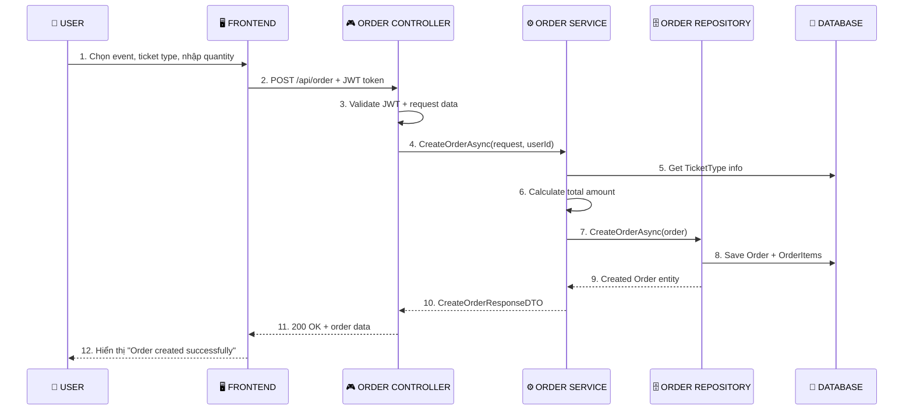
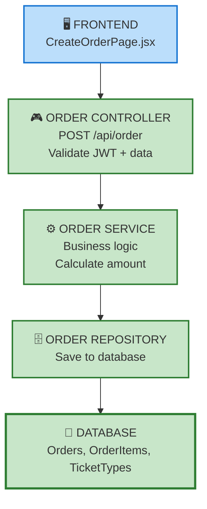

# 🎫 CREATE ORDER FLOW

## 🔄 **LUỒNG CHÍNH**

## 🏗️ **KIẾN TRÚC**

## 📋 **CÁC BƯỚC CHÍNH**

### **1. Frontend**
- User chọn event và ticket type
- Nhập quantity, seat number
- Gọi API với JWT token

### **2. Controller**
- Validate JWT token
- Extract userId từ token
- Validate request data
- Gọi OrderService

### **3. Service**
- Validate quantity > 0
- Get TicketType từ database
- Calculate: totalAmount = price × quantity
- Create Order entity
- Gọi OrderRepository

### **4. Repository**
- Set timestamps và status = "Pending"
- Save Order và OrderItems
- Load related data
- Return Order entity

### **5. Response**
- Map Order thành CreateOrderResponseDTO
- Return success response với order data

## 🛡️ **ERROR HANDLING**

- **401**: JWT token không hợp lệ
- **400**: Request data không hợp lệ
- **400**: TicketType không tồn tại
- **400**: Event không tồn tại

## 🎯 **MINDSET**

**"Tôi cần tới cái gì, tôi làm tới cái đó đi":**
- Controller: Xử lý HTTP request
- Service: Xử lý business logic
- Repository: Lưu dữ liệu
- Mapper: Chuyển đổi dữ liệu
