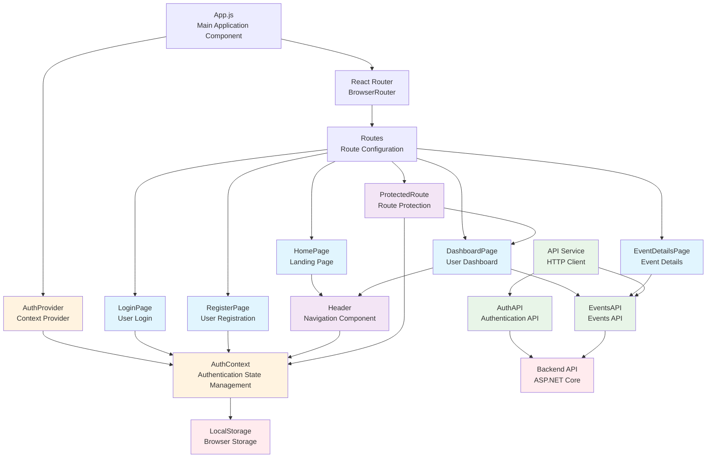
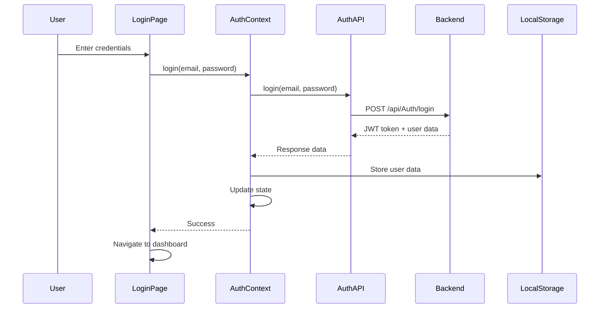
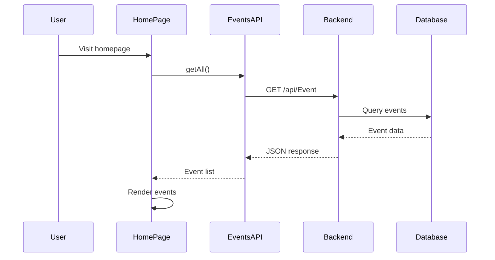
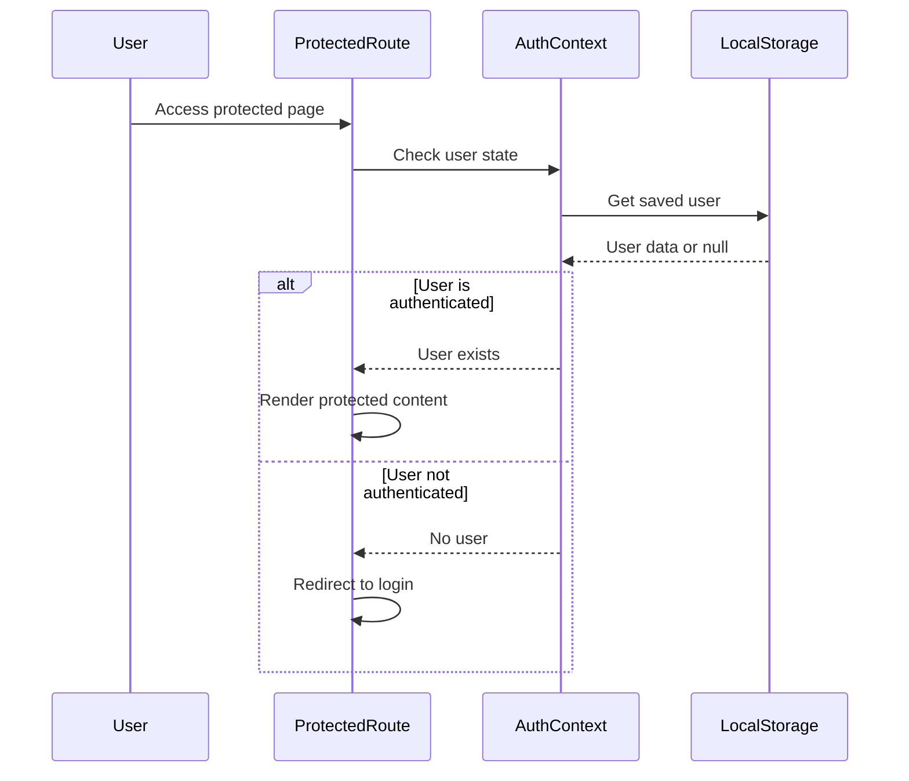

# Sơ đồ Kiến trúc Frontend - TheGrind5 Event Management

## Tổng quan
Frontend được xây dựng bằng React với kiến trúc component-based, sử dụng React Router cho navigation và Context API cho state management.

## Sơ đồ Kiến trúc Frontend



## Luồng Xử lý Chính

### 1. Authentication Flow


### 2. Event Loading Flow


### 3. Protected Route Flow


## Cấu trúc Component Hierarchy

### 1. App Component
- **App.js**: Root component với AuthProvider và Router
- **AppRoutes**: Route configuration với authentication logic

### 2. Context Layer
- **AuthContext**: Global authentication state
- **AuthProvider**: Context provider với authentication methods

### 3. Pages
- **HomePage**: Landing page hiển thị danh sách events
- **LoginPage**: Form đăng nhập
- **RegisterPage**: Form đăng ký
- **DashboardPage**: Dashboard cho user đã đăng nhập
- **EventDetailsPage**: Chi tiết event

### 4. Components
- **Header**: Navigation bar với authentication status
- **ProtectedRoute**: Route protection wrapper

### 5. Services
- **API Service**: HTTP client configuration
- **AuthAPI**: Authentication API calls
- **EventsAPI**: Events API calls

## State Management

### AuthContext State
```javascript
{
  user: null | UserObject,
  loading: boolean,
  login: function,
  register: function,
  logout: function
}
```

### User Object Structure
```javascript
{
  userId: number,
  fullName: string,
  email: string,
  phone: string,
  role: string
}
```

## Routing Configuration

### Public Routes
- `/` - HomePage (public)
- `/login` - LoginPage (redirect if authenticated)
- `/register` - RegisterPage (redirect if authenticated)
- `/event/:id` - EventDetailsPage (public)

### Protected Routes
- `/dashboard` - DashboardPage (requires authentication)

### Route Protection Logic
- **Public routes**: Accessible to all users
- **Auth routes**: Redirect to dashboard if already logged in
- **Protected routes**: Redirect to login if not authenticated

## API Integration

### Base Configuration
- **Base URL**: `http://localhost:5000/api`
- **Content-Type**: `application/json`
- **Error Handling**: Centralized error handling

### Authentication API
- `POST /Auth/login` - User login
- `POST /Auth/register` - User registration
- `GET /Auth/user/{userId}` - Get user by ID

### Events API
- `GET /Event` - Get all events
- `GET /Event/{id}` - Get event by ID
- `POST /Event` - Create event (authenticated)
- `PUT /Event/{id}` - Update event (authenticated)
- `DELETE /Event/{id}` - Delete event (authenticated)
- `GET /Event/host/{hostId}` - Get events by host

## Data Flow

### 1. User Authentication
1. User enters credentials in LoginPage
2. AuthContext calls AuthAPI
3. API sends request to backend
4. Backend validates and returns JWT token
5. Token and user data stored in LocalStorage
6. AuthContext updates global state
7. User redirected to dashboard

### 2. Event Display
1. Component mounts and calls EventsAPI
2. API fetches data from backend
3. Backend queries database
4. Data returned and displayed in UI
5. Error handling for failed requests

### 3. Route Protection
1. User navigates to protected route
2. ProtectedRoute checks AuthContext
3. If authenticated: render content
4. If not authenticated: redirect to login

## Styling và UI

### CSS Classes
- **Grid system**: `.grid`, `.grid-2`, `.grid-3`
- **Cards**: `.card`, `.card-body`, `.card-title`
- **Forms**: `.form`, `.form-group`, `.form-input`
- **Buttons**: `.btn`, `.btn-primary`, `.btn-secondary`
- **Alerts**: `.alert`, `.alert-error`
- **Loading**: `.loading-container`, `.loading-spinner`

### Responsive Design
- Mobile-first approach
- Grid system for layout
- Responsive grid columns
- Mobile-friendly navigation

## Error Handling

### API Error Handling
- Network errors
- HTTP status errors
- JSON parsing errors
- Timeout handling

### User Experience
- Loading states
- Error messages
- Form validation
- Success feedback

## Performance Optimizations

### Code Splitting
- Route-based code splitting
- Lazy loading for pages

### State Management
- Context API for global state
- Local state for component-specific data
- Efficient re-renders

### API Caching
- LocalStorage for user data
- No API response caching (real-time data)
