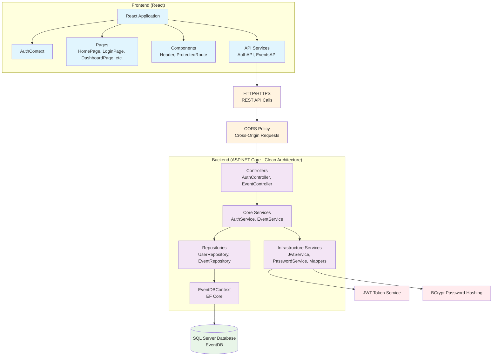
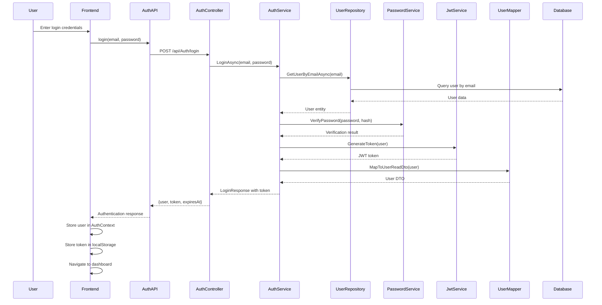
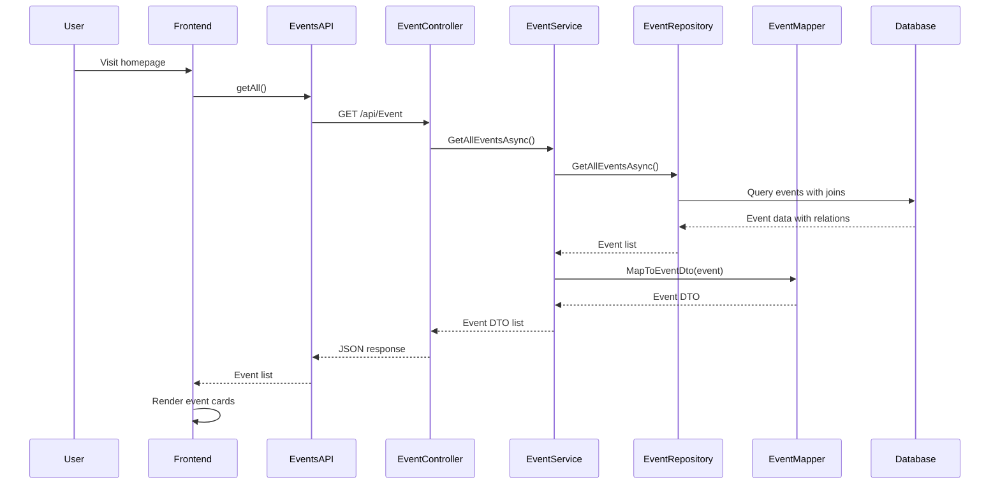
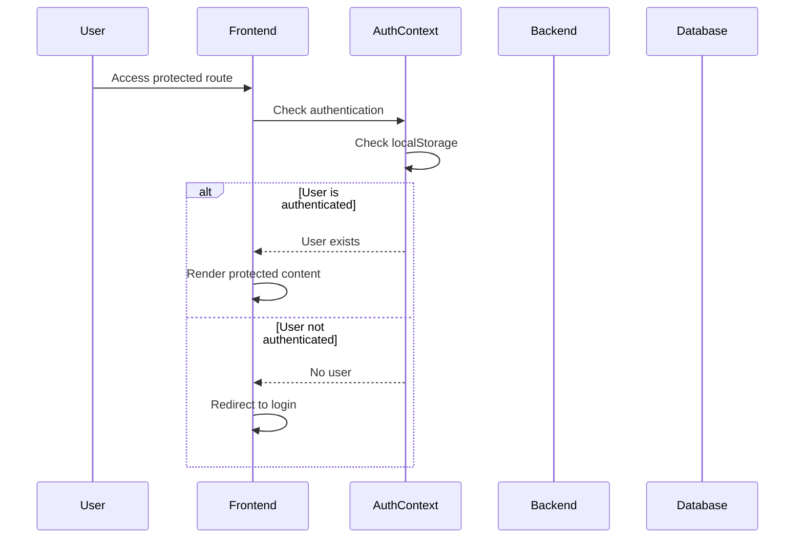
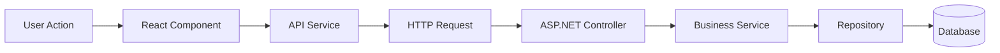
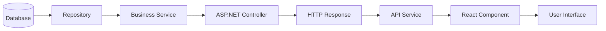
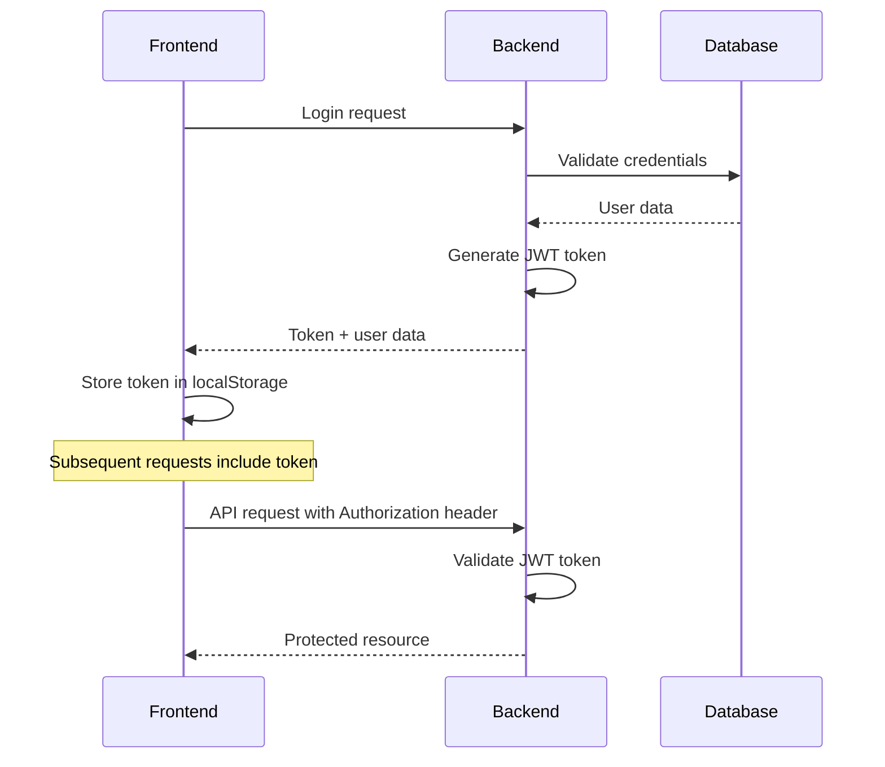
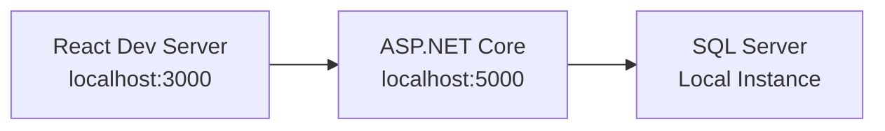
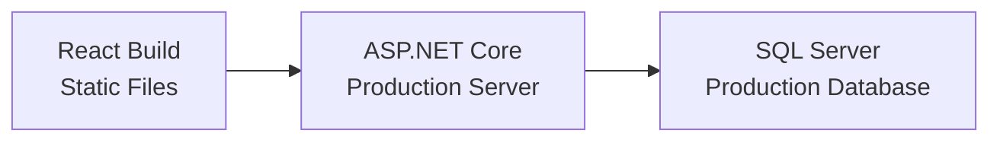

# Sơ đồ Tích hợp Backend-Frontend - TheGrind5 Event Management

## Tổng quan
Hệ thống sử dụng kiến trúc client-server với React frontend và ASP.NET Core backend, giao tiếp qua REST API với JWT authentication.

## Sơ đồ Tích hợp Tổng thể



## Luồng Tích hợp Chính

### 1. User Authentication Flow (Clean Architecture)


### 2. Event Management Flow (Clean Architecture)


### 3. Protected Route Access Flow


## API Integration Details

### Authentication Endpoints
| Method | Endpoint | Frontend Usage | Backend Handler |
|--------|----------|----------------|-----------------|
| POST | `/api/Auth/login` | AuthAPI.login() | AuthController.Login() |
| POST | `/api/Auth/register` | AuthAPI.register() | AuthController.Register() |
| GET | `/api/Auth/me` | AuthAPI.getCurrentUser() | AuthController.GetCurrentUser() |
| GET | `/api/Auth/user/{id}` | AuthAPI.getUser() | AuthController.GetUserById() |

### Event Endpoints
| Method | Endpoint | Frontend Usage | Backend Handler |
|--------|----------|----------------|-----------------|
| GET | `/api/Event` | EventsAPI.getAll() | EventController.GetAllEvents() |
| GET | `/api/Event/{id}` | EventsAPI.getById() | EventController.GetEventById() |
| POST | `/api/Event` | EventsAPI.create() | EventController.CreateEvent() |
| PUT | `/api/Event/{id}` | EventsAPI.update() | EventController.UpdateEvent() |
| DELETE | `/api/Event/{id}` | EventsAPI.delete() | EventController.DeleteEvent() |
| GET | `/api/Event/host/{id}` | EventsAPI.getByHost() | EventController.GetEventsByHost() |

## Data Flow Architecture

### 1. Request Flow


### 2. Response Flow


## Security Integration

### JWT Token Flow


### CORS Configuration
- **Allowed Origins**: `http://localhost:3000`, `http://localhost:5173`, `https://localhost:5173`
- **Allowed Methods**: GET, POST, PUT, DELETE
- **Allowed Headers**: Any header
- **Credentials**: Not configured (stateless)

## Error Handling Integration

### Frontend Error Handling
```javascript
// API Service Error Handling
try {
  const response = await fetch(url, options);
  if (!response.ok) {
    const errorData = await response.json().catch(() => ({}));
    throw new Error(errorData.message || 'Request failed');
  }
  return response.json();
} catch (error) {
  console.error('API Error:', error);
  throw error;
}
```

### Backend Error Handling
```csharp
// Controller Error Handling
try {
    var result = await _service.ProcessRequest();
    return Ok(result);
} catch (Exception ex) {
    return BadRequest(new { message = "Error occurred", error = ex.Message });
}
```

## State Management Integration

### Frontend State
- **AuthContext**: Global authentication state
- **Component State**: Local component state
- **LocalStorage**: Persistent user data

### Backend State
- **Database**: Persistent data storage
- **Session**: Stateless (JWT-based)
- **Cache**: No caching implemented

## Performance Considerations

### Frontend Optimizations
- **Code Splitting**: Route-based splitting
- **Lazy Loading**: Component lazy loading
- **State Management**: Efficient re-renders

### Backend Optimizations
- **Database Queries**: EF Core optimizations
- **Connection Pooling**: SQL Server connection pooling
- **Response Compression**: Not configured

### Network Optimizations
- **HTTP/2**: Not explicitly configured
- **Compression**: Not configured
- **Caching**: No caching headers

## Deployment Architecture

### Development Environment


### Production Environment


## Monitoring và Logging

### Frontend Logging
- **Console Logs**: Development debugging
- **Error Boundaries**: React error handling
- **Network Monitoring**: Browser dev tools

### Backend Logging
- **Console Logs**: Development debugging
- **Exception Handling**: Try-catch blocks
- **Database Logging**: EF Core logging

## Testing Strategy

### Frontend Testing
- **Unit Tests**: Component testing
- **Integration Tests**: API integration
- **E2E Tests**: User workflow testing

### Backend Testing
- **Unit Tests**: Service and repository testing
- **Integration Tests**: API endpoint testing
- **Database Tests**: Data access testing

## Scalability Considerations

### Frontend Scalability
- **Code Splitting**: Reduce bundle size
- **Lazy Loading**: Load components on demand
- **State Management**: Efficient state updates

### Backend Scalability
- **Database Indexing**: Query optimization
- **Connection Pooling**: Database connection management
- **Caching**: Future implementation
- **Load Balancing**: Future implementation

## Security Best Practices

### Frontend Security
- **Input Validation**: Form validation
- **XSS Prevention**: React's built-in protection
- **Token Storage**: Secure localStorage usage

### Backend Security
- **Authentication**: JWT token validation
- **Authorization**: Role-based access control
- **Input Validation**: Model validation
- **SQL Injection**: EF Core protection
- **Password Security**: BCrypt hashing
