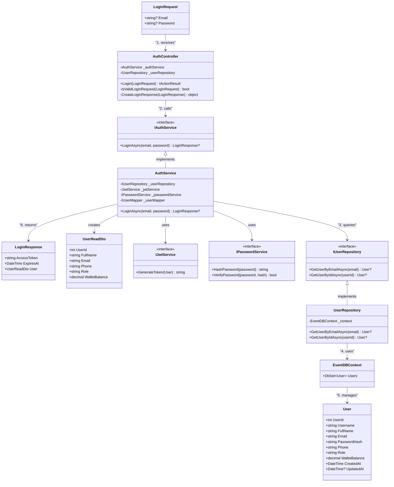

# Login Flow Class Diagram

## Luồng xử lý Login

1. **LoginRequest** → **AuthController**: Nhận request từ client
2. **AuthController** → **IAuthService**: Gọi service layer
3. **AuthService** → **IUserRepository**: Query user data
4. **UserRepository** → **EventDBContext**: Truy cập database
5. **EventDBContext** → **User**: Quản lý entity
6. **AuthService** → **LoginResponse**: Trả về kết quả

## Kiến trúc Layers

- **DTOs**: Data Transfer Objects cho input/output
- **Controllers**: Xử lý HTTP requests
- **Services**: Business logic layer
- **Repositories**: Data access layer  
- **Models & Data**: Entity models và database context
