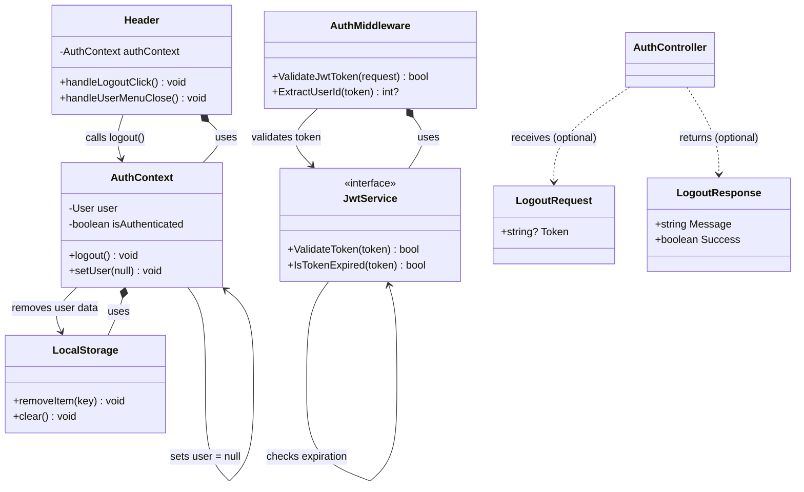

# Logout Flow Class Diagram



## Logout Flow Description

### Frontend Logout Process (Client-side)

1. **User clicks Logout** → Header.handleLogoutClick()
2. **Header** → AuthContext.logout()
3. **AuthContext** → LocalStorage.removeItem('user')
4. **AuthContext** → setUser(null)
5. **Redirect** to login page

### Backend JWT Validation (Server-side)

1. **Incoming requests** → AuthMiddleware.ValidateJwtToken()
2. **AuthMiddleware** → JwtService.ValidateToken()
3. **JwtService** → JwtService.IsTokenExpired()
4. **If expired/invalid** → Return 401 Unauthorized

## Key Points

### Why No Backend Logout Endpoint?

- **JWT is Stateless**: Tokens are self-contained and don't require server-side session storage
- **Client-side Logout**: Simply remove token from client storage
- **Token Expiration**: Tokens expire automatically (usually 7 days)
- **Security**: Invalid tokens are rejected by middleware on next request

### Frontend Implementation

```javascript
// AuthContext.js
const logout = () => {
  setUser(null);
  localStorage.removeItem('user');
  // Redirect to login page
};

// Header.jsx
<MenuItem onClick={() => { 
  handleUserMenuClose(); 
  logout(); 
}}>
  <Logout sx={{ mr: 1 }} />
  Logout
</MenuItem>
```

### Backend Middleware Validation

```csharp
// JWT Middleware validates every request
public void Configure(IApplicationBuilder app)
{
    app.UseAuthentication(); // Validates JWT tokens
    app.UseAuthorization();  // Checks permissions
}
```

## Security Considerations

1. **Token Blacklisting**: Not implemented (would require server-side storage)
2. **Short Expiration**: Tokens expire in 7 days
3. **HTTPS Only**: Tokens transmitted over secure connection
4. **Client Cleanup**: Remove tokens from all client storage locations
