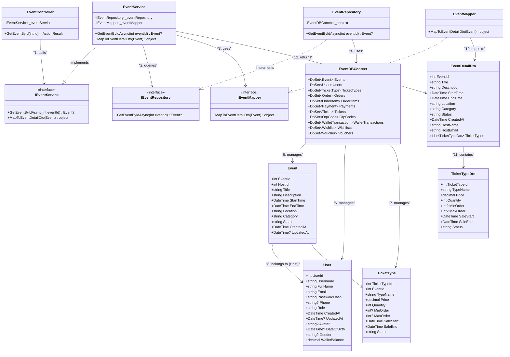

# View Event Detail - Class Diagram (Mermaid)

## Mô tả luồng View Event Detail

### 🏗️ Kiến trúc phân lớp:

1. **Controller Layer**: `EventController` - Điểm vào xử lý HTTP requests
2. **Service Layer**: `IEventService`/`EventService` - Chứa business logic
3. **Repository Layer**: `IEventRepository`/`EventRepository` - Tầng truy cập dữ liệu
4. **Data Access Layer**: `EventDBContext` - Quản lý kết nối database
5. **Domain Models**: `Event`, `User`, `TicketType` - Các thực thể domain
6. **Mapper Layer**: `IEventMapper`/`EventMapper` - Chuyển đổi objects
7. **DTOs**: `EventDetailDto`, `TicketTypeDto` - Data transfer objects

### 🔄 Luồng tương tác:

1. **Client** → `EventController.GetEventById(id)`
2. **Controller** → `IEventService.GetEventByIdAsync(id)`
3. **Service** → `IEventRepository.GetEventByIdAsync(id)`
4. **Repository** → `EventDBContext` (với Include để lấy Host và TicketTypes)
5. **Database** → Trả về Event entity với thông tin liên quan
6. **Mapper** → Chuyển đổi Event thành `EventDetailDto`
7. **Response** → Trả về cho Client

### 📋 Pattern áp dụng:

- **Dependency Injection**: Tất cả dependencies được inject
- **Repository Pattern**: Tách biệt logic truy cập dữ liệu
- **Service Layer Pattern**: Chứa business logic
- **DTO Pattern**: Tách biệt domain model khỏi API response
- **Mapper Pattern**: Chuyển đổi giữa domain model và DTO
- **Layered Architecture**: Phân tách rõ ràng các lớp chức năng
