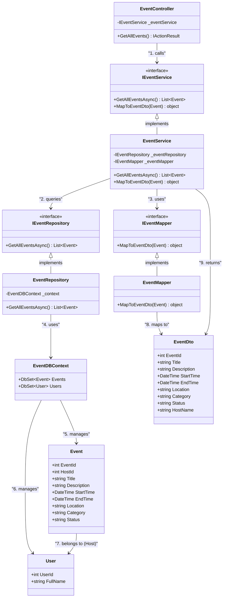

# Class Diagram - View Event Flow

## Mô tả
Class diagram này mô tả luồng xem sự kiện (view event) trong hệ thống TheGrind5 Event Management, tuân theo kiến trúc phân lớp (layered architecture) tương tự như login/register flow.

## Class Diagram



## Luồng View Event Flow

### **GetAllEvents Flow**
1. **Client Request** → `EventController.GetAllEvents()`
2. **Service Call** → `IEventService.GetAllEventsAsync()`
3. **Repository Query** → `IEventRepository.GetAllEventsAsync()`
4. **Database Query** → `EventDBContext.Events` với Include Host
5. **Response Mapping** → `IEventMapper.MapToEventDto(Event)`
6. **Success Response** → List of EventDto

## Các thành phần chính

### **Controller Layer**
- **EventController**: Entry point cho view event requests
- **Dependencies**: `IEventService`
- **Methods**: `GetAllEvents()`

### **Service Layer**
- **IEventService/EventService**: Business logic cho view event operations
- **IEventMapper/EventMapper**: Mapping giữa Event entity và EventDto
- **Dependencies**: `IEventRepository`, `IEventMapper`

### **Repository Layer**
- **IEventRepository/EventRepository**: Data access layer
- **EventDBContext**: Database context với Entity Framework
- **Dependencies**: `EventDBContext`

### **Models & DTOs**
- **Event**: Entity model chính với relationships
- **User**: Host information
- **EventDto**: Basic event information

## Database Operations

### **GetAllEvents Query**
```sql
SELECT e.*, u.FullName as HostName
FROM Events e
LEFT JOIN Users u ON e.HostId = u.UserId
WHERE e.Status = 'Open'
ORDER BY e.StartTime
```

## Key Features

### **1. Data Relationships**
- **Event → User**: Many-to-One (Host relationship)

### **2. Response Mapping**
- **EventDto**: Basic event info với HostName

### **3. Database Optimization**
- **Include statements**: Eager loading của Host entity
- **Status filtering**: Chỉ lấy events có Status = "Open"
- **Ordering**: Sắp xếp theo StartTime

### **4. Error Handling**
- **Exception handling**: Try-catch cho database errors
- **Data validation**: Validate response data

## So sánh với Login/Register Flow

| Aspect | Login/Register | View Event |
|--------|----------------|------------|
| **Input** | User credentials/registration data | No parameters |
| **Authentication** | Required | Not required (public) |
| **Database** | User operations | Event operations với joins |
| **Output** | User info + JWT | Event list + basic info |
| **Complexity** | Simple CRUD | Simple queries với basic relationships |

## Security Considerations

- ✅ **Public Access**: View events không cần authentication
- ✅ **Data Filtering**: Chỉ hiển thị events có Status = "Open"
- ✅ **SQL Injection Prevention**: Sử dụng Entity Framework parameterized queries
- ✅ **Data Validation**: Validate EventId trước khi query

## Performance Optimizations

- ✅ **Eager Loading**: Include Host entity trong một query
- ✅ **Status Filtering**: Database-level filtering
- ✅ **Ordering**: Database-level ordering
- ✅ **Pagination**: Có thể thêm pagination cho large datasets
