# Class Diagram - Buy Ticket Flow (Order Process)

## Mô tả tổng quan
Sơ đồ này minh họa kiến trúc của luồng mua vé (Buy Ticket/Order Process) - luồng phức tạp nhất trong hệ thống quản lý sự kiện. Luồng bao gồm việc tạo đơn hàng, xử lý thanh toán, tạo vé và quản lý inventory.

### Các thành phần chính:
- **Controller Layer**: OrderController xử lý HTTP requests
- **Service Layer**: OrderService, WalletService, TicketService chứa business logic
- **Repository Layer**: OrderRepository, UserRepository xử lý data access
- **Mapper Layer**: OrderMapper chuyển đổi giữa entities và DTOs
- **Entity Models**: Order, OrderItem, Ticket, Payment, TicketType, Event, User, WalletTransaction
- **DTOs**: Request/Response DTOs cho API communication

### Validation Rules chính:
- **Quantity Validation**: Quantity phải > 0 và trong range MinOrder/MaxOrder
- **Event Status Validation**: Event phải có status = "Open"
- **TicketType Status Validation**: TicketType phải có status = "Active"
- **Time Validation**: Kiểm tra SaleStart/SaleEnd của TicketType
- **Inventory Validation**: Kiểm tra số lượng vé còn lại
- **Order Status Validation**: Chỉ cho phép các status hợp lệ
- **Authorization Validation**: Chỉ owner hoặc admin mới có quyền truy cập

## Class Diagram

```mermaid
classDiagram
    %% Request DTOs
    class CreateOrderRequestDTO {
        +int EventId
        +int TicketTypeId
        +int Quantity
        +string? SeatNo
    }

    class PaymentRequest {
        +string PaymentMethod
        +string TransactionId
    }

    class UpdateOrderStatusRequest {
        +string Status
    }

    %% Response DTOs
    class CreateOrderResponseDTO {
        +int OrderId
        +int CustomerId
        +string EventTitle
        +string TicketTypeName
        +int Quantity
        +decimal TotalAmount
        +string Status
        +DateTime CreatedAt
        +string Message
    }

    class OrderDTO {
        +int OrderId
        +int CustomerId
        +string CustomerName
        +decimal Amount
        +string Status
        +DateTime CreatedAt
        +List~OrderItemDTO~ OrderItems
    }

    %% Controller Layer
    class OrderController {
        -IOrderService _orderService
        -IWalletService _walletService
        +CreateOrder(CreateOrderRequestDTO): IActionResult
        +GetOrderById(int): IActionResult
        +GetUserOrders(int): IActionResult
        +GetMyOrders(): IActionResult
        +UpdateOrderStatus(int, UpdateOrderStatusRequest): IActionResult
        +CancelOrder(int): IActionResult
        +ProcessPayment(int, PaymentRequest): IActionResult
        +CleanupExpiredOrders(): IActionResult
        +GetTicketTypeInventory(int): IActionResult
        -GetUserIdFromToken(): int?
        -IsValidCreateOrderRequest(CreateOrderRequestDTO): bool
    }

    %% Service Layer Interfaces
    class IOrderService {
        <<interface>>
        +CreateOrderAsync(CreateOrderRequestDTO, int): CreateOrderResponseDTO
        +GetOrderByIdAsync(int): OrderDTO?
        +GetUserOrdersAsync(int): List~OrderDTO~
        +GetOrderModelByIdAsync(int): Order?
        +UpdateOrderStatusAsync(int, string): bool
        +GetExpiredOrdersAsync(): List~Order~
        +CleanupExpiredOrdersAsync(): int
        +GetTicketTypeInventoryAsync(int): object
        +ValidateUserExistsAsync(int): bool
        +MapToOrderDto(Order): OrderDTO
        +MapFromCreateOrderRequest(CreateOrderRequestDTO, int): Order
    }

    class IWalletService {
        <<interface>>
        +GetWalletBalanceAsync(int): decimal
        +UpdateWalletBalanceAsync(int, decimal): bool
        +CreateTransactionAsync(WalletTransaction): WalletTransaction
        +GetTransactionByIdAsync(int): WalletTransaction?
        +GetUserTransactionsAsync(int, int, int): List~WalletTransaction~
        +DepositAsync(int, decimal, string?, string?): WalletTransaction
        +WithdrawAsync(int, decimal, string?, string?): WalletTransaction
        +ProcessPaymentAsync(int, decimal, int, string?): WalletTransaction
        +ProcessRefundAsync(int, decimal, int, string?): WalletTransaction
        +HasSufficientBalanceAsync(int, decimal): bool
        +ValidateTransactionAsync(WalletTransaction): bool
    }

    class ITicketService {
        <<interface>>
        +GetTicketsByUserIdAsync(int): IEnumerable~Ticket~
        +GetTicketByIdAsync(int): Ticket
        +GetTicketsByEventIdAsync(int): IEnumerable~Ticket~
        +GetTicketTypesByEventIdAsync(int): IEnumerable~TicketType~
        +CheckInTicketAsync(int): Ticket
        +CreateTicketAsync(int, int, string): Ticket
        +CreateTicketsForOrderItemAsync(int, int, int): IEnumerable~Ticket~
        +RefundTicketAsync(int): Ticket
        +IsTicketValidAsync(int): bool
        +GenerateTicketSerialNumberAsync(int, int): string
        +GetTicketTypeByIdAsync(int): TicketType
        +GetSoldTicketsCountAsync(int): int
    }

    %% Service Layer Implementations
    class OrderService {
        -IOrderRepository _orderRepository
        -IOrderMapper _orderMapper
        -ITicketService _ticketService
        -EventDBContext _context
        +CreateOrderAsync(CreateOrderRequestDTO, int): CreateOrderResponseDTO
        +GetOrderByIdAsync(int): OrderDTO?
        +GetUserOrdersAsync(int): List~OrderDTO~
        +GetOrderModelByIdAsync(int): Order?
        +UpdateOrderStatusAsync(int, string): bool
        +GetExpiredOrdersAsync(): List~Order~
        +CleanupExpiredOrdersAsync(): int
        +GetTicketTypeInventoryAsync(int): object
        +ValidateUserExistsAsync(int): bool
        +MapToOrderDto(Order): OrderDTO
        +MapFromCreateOrderRequest(CreateOrderRequestDTO, int): Order
        -GetAvailableQuantityAsync(int): int
        -CreateTicketsForOrderAsync(int): Task
    }

    class WalletService {
        -EventDBContext _context
        -IUserRepository _userRepository
        +GetWalletBalanceAsync(int): decimal
        +UpdateWalletBalanceAsync(int, decimal): bool
        +CreateTransactionAsync(WalletTransaction): WalletTransaction
        +GetTransactionByIdAsync(int): WalletTransaction?
        +GetUserTransactionsAsync(int, int, int): List~WalletTransaction~
        +DepositAsync(int, decimal, string?, string?): WalletTransaction
        +WithdrawAsync(int, decimal, string?, string?): WalletTransaction
        +ProcessPaymentAsync(int, decimal, int, string?): WalletTransaction
        +ProcessRefundAsync(int, decimal, int, string?): WalletTransaction
        +HasSufficientBalanceAsync(int, decimal): bool
        +ValidateTransactionAsync(WalletTransaction): bool
    }

    class TicketService {
        -EventDBContext _context
        +GetTicketsByUserIdAsync(int): IEnumerable~Ticket~
        +GetTicketByIdAsync(int): Ticket
        +GetTicketsByEventIdAsync(int): IEnumerable~Ticket~
        +GetTicketTypesByEventIdAsync(int): IEnumerable~TicketType~
        +CheckInTicketAsync(int): Ticket
        +CreateTicketAsync(int, int, string): Ticket
        +CreateTicketsForOrderItemAsync(int, int, int): IEnumerable~Ticket~
        +RefundTicketAsync(int): Ticket
        +IsTicketValidAsync(int): bool
        +GenerateTicketSerialNumberAsync(int, int): string
        +GetTicketTypeByIdAsync(int): TicketType
        +GetSoldTicketsCountAsync(int): int
    }

    %% Repository Layer Interfaces
    class IOrderRepository {
        <<interface>>
        +CreateOrderAsync(Order): Order
        +GetOrderByIdAsync(int): Order?
        +UpdateOrderStatusAsync(int, string): bool
        +GetOrdersByUserIdAsync(int): List~Order~
        +UpdateOrderAsync(int, Order): Order?
        +DeleteOrderAsync(int): bool
    }

    class IUserRepository {
        <<interface>>
        +GetUserByIdAsync(int): User?
        +UpdateUserAsync(User): bool
    }

    %% Repository Layer Implementations
    class OrderRepository {
        -EventDBContext _context
        +CreateOrderAsync(Order): Order
        +GetOrderByIdAsync(int): Order?
        +UpdateOrderStatusAsync(int, string): bool
        +GetOrdersByUserIdAsync(int): List~Order~
        +UpdateOrderAsync(int, Order): Order?
        +DeleteOrderAsync(int): bool
    }

    class UserRepository {
        -EventDBContext _context
        +GetUserByIdAsync(int): User?
        +UpdateUserAsync(User): bool
    }

    %% Mapper Layer
    class IOrderMapper {
        <<interface>>
        +MapToOrderDto(Order): OrderDTO
        +MapToOrderDetailDto(Order): OrderDetailDto
        +MapToCreateOrderResponse(Order): CreateOrderResponseDTO
        +MapFromCreateOrderRequest(CreateOrderRequestDTO, int): Order
        +MapToOrderItemDto(OrderItem): OrderItemDTO
    }

    class OrderMapper {
        +MapToOrderDto(Order): OrderDTO
        +MapToOrderDetailDto(Order): OrderDetailDto
        +MapToCreateOrderResponse(Order): CreateOrderResponseDTO
        +MapFromCreateOrderRequest(CreateOrderRequestDTO, int): Order
        +MapToOrderItemDto(OrderItem): OrderItemDTO
    }

    %% Data Context
    class EventDBContext {
        +DbSet~Order~ Orders
        +DbSet~OrderItem~ OrderItems
        +DbSet~Ticket~ Tickets
        +DbSet~Payment~ Payments
        +DbSet~TicketType~ TicketTypes
        +DbSet~Event~ Events
        +DbSet~User~ Users
        +DbSet~WalletTransaction~ WalletTransactions
    }

    %% Entity Models
    class Order {
        +int OrderId
        +int CustomerId
        +decimal Amount
        +string Status
        +string PaymentMethod
        +DateTime CreatedAt
        +DateTime? UpdatedAt
        +User Customer
        +List~OrderItem~ OrderItems
        +List~Payment~ Payments
    }

    class OrderItem {
        +int OrderItemId
        +int OrderId
        +int TicketTypeId
        +int Quantity
        +string SeatNo
        +string Status
        +Order Order
        +TicketType TicketType
        +List~Ticket~ Tickets
    }

    class Ticket {
        +int TicketId
        +int TicketTypeId
        +int? OrderItemId
        +string SerialNumber
        +string Status
        +DateTime IssuedAt
        +DateTime? UsedAt
        +DateTime? RefundedAt
        +OrderItem OrderItem
        +TicketType TicketType
    }

    class Payment {
        +int PaymentId
        +int OrderId
        +decimal Amount
        +string Method
        +string Status
        +DateTime PaymentDate
        +Order Order
    }

    class TicketType {
        +int TicketTypeId
        +int EventId
        +string TypeName
        +decimal Price
        +int Quantity
        +int? MinOrder
        +int? MaxOrder
        +DateTime SaleStart
        +DateTime SaleEnd
        +string Status
        +Event Event
        +List~OrderItem~ OrderItems
        +List~Ticket~ Tickets
    }

    class Event {
        +int EventId
        +int HostId
        +string Title
        +string Description
        +DateTime StartTime
        +DateTime EndTime
        +string Location
        +string Category
        +string Status
        +DateTime CreatedAt
        +DateTime? UpdatedAt
        +User Host
        +List~TicketType~ TicketTypes
    }

    class User {
        +int UserId
        +string Username
        +string FullName
        +string Email
        +string PasswordHash
        +string Phone
        +string Role
        +decimal WalletBalance
        +DateTime CreatedAt
        +DateTime? UpdatedAt
        +string? Avatar
        +DateTime? DateOfBirth
        +string? Gender
    }

    class WalletTransaction {
        +int TransactionId
        +int UserId
        +string TransactionType
        +decimal Amount
        +string Status
        +string? Description
        +string? ReferenceId
        +DateTime CreatedAt
        +DateTime? CompletedAt
        +decimal BalanceBefore
        +decimal BalanceAfter
        +User User
    }

    %% Response DTOs
    class OrderItemDTO {
        +int OrderItemId
        +int TicketTypeId
        +string TicketTypeName
        +int Quantity
        +decimal UnitPrice
        +decimal TotalPrice
        +string? SeatNo
        +string Status
    }

    class OrderDetailDto {
        +int OrderId
        +int CustomerId
        +string CustomerName
        +string CustomerEmail
        +decimal Amount
        +string Status
        +string PaymentMethod
        +DateTime CreatedAt
        +DateTime? UpdatedAt
        +List~OrderItemDTO~ OrderItems
        +List~PaymentDTO~ Payments
    }

    class PaymentDTO {
        +int PaymentId
        +int OrderId
        +decimal Amount
        +string PaymentMethod
        +string Status
        +DateTime CreatedAt
        +string TransactionId
    }

    %% Relationships
    OrderController --> IOrderService : "1. calls"
    OrderController --> IWalletService : "2. calls"
    
    OrderService ..|> IOrderService : "implements"
    OrderService --> IOrderRepository : "3. queries"
    OrderService --> IOrderMapper : "4. uses"
    OrderService --> ITicketService : "5. uses"
    
    WalletService ..|> IWalletService : "implements"
    WalletService --> IUserRepository : "6. queries"
    
    TicketService ..|> ITicketService : "implements"
    TicketService --> EventDBContext : "7. uses"
    
    OrderRepository ..|> IOrderRepository : "implements"
    OrderRepository --> EventDBContext : "8. uses"
    
    UserRepository ..|> IUserRepository : "implements"
    UserRepository --> EventDBContext : "9. uses"
    
    OrderMapper ..|> IOrderMapper : "implements"
    
    EventDBContext --> Order : "10. manages"
    EventDBContext --> OrderItem : "11. manages"
    EventDBContext --> Ticket : "12. manages"
    EventDBContext --> Payment : "13. manages"
    EventDBContext --> TicketType : "14. manages"
    EventDBContext --> Event : "15. manages"
    EventDBContext --> User : "16. manages"
    EventDBContext --> WalletTransaction : "17. manages"
    
    Order --> User : "18. belongs to (Customer)"
    Order --> OrderItem : "19. has many"
    Order --> Payment : "20. has many"
    
    OrderItem --> TicketType : "21. belongs to"
    OrderItem --> Ticket : "22. has many"
    
    Ticket --> TicketType : "23. belongs to"
    
    TicketType --> Event : "24. belongs to"
    
    Event --> User : "25. belongs to (Host)"
    
    User --> WalletTransaction : "26. has many"
    
    WalletTransaction --> Order : "27. references (optional)"
    
    OrderMapper --> OrderDTO : "28. maps to"
    OrderMapper --> CreateOrderResponseDTO : "29. maps to"
    OrderMapper --> OrderDetailDto : "30. maps to"
    OrderMapper --> OrderItemDTO : "31. maps to"
    
    CreateOrderRequestDTO --> OrderController : "32. receives"
    CreateOrderResponseDTO --> OrderController : "33. returns"
    PaymentRequest --> OrderController : "34. receives"
    UpdateOrderStatusRequest --> OrderController : "35. receives"
```

## Luồng hoạt động chính (Buy Ticket Process)

### 1. Tạo Order (CreateOrderAsync)
1. **OrderController** nhận `CreateOrderRequestDTO`
2. **OrderController** gọi `IOrderService.CreateOrderAsync()`
3. **OrderService** thực hiện business validation:
   - Kiểm tra Event status = "Open"
   - Kiểm tra TicketType status = "Active"
   - Kiểm tra thời gian bán vé (SaleStart/SaleEnd)
   - Kiểm tra MinOrder/MaxOrder constraints
   - Kiểm tra số lượng vé còn lại (Available Quantity)
4. **OrderService** sử dụng `IOrderMapper` để map request thành Order entity
5. **OrderService** gọi `IOrderRepository.CreateOrderAsync()` để lưu vào database
6. **OrderRepository** sử dụng `EventDBContext` để persist data
7. **OrderMapper** map Order entity thành `CreateOrderResponseDTO`
8. Trả về response cho client

### 2. Xử lý Payment (ProcessPayment)
1. **OrderController** nhận `PaymentRequest`
2. **OrderController** gọi `IWalletService.HasSufficientBalanceAsync()`
3. Nếu đủ số dư, **OrderController** gọi `IWalletService.ProcessPaymentAsync()`
4. **WalletService** tạo `WalletTransaction` và cập nhật balance thông qua `IUserRepository`
5. **OrderController** gọi `IOrderService.UpdateOrderStatusAsync()` với status "Paid"
6. **OrderService** gọi `ITicketService.CreateTicketsForOrderItemAsync()` để tạo vé
7. **TicketService** tạo các Ticket entities với serial number unique thông qua `GenerateTicketSerialNumberAsync()`

### 3. Inventory Management
- **OrderService** có method `GetTicketTypeInventoryAsync()` để tracking:
  - Total quantity
  - Sold quantity (Paid orders)
  - Reserved quantity (Pending orders)
  - Available quantity
  - Utilization rate

### 4. Order Management
- **OrderController.GetUserOrders()**: Lấy danh sách orders của user cụ thể
- **OrderController.GetMyOrders()**: Lấy danh sách orders của user hiện tại (từ token)
- **OrderController.UpdateOrderStatus()**: Cập nhật status của order (chỉ admin)
- **OrderController.CancelOrder()**: Hủy order (chỉ owner và khi status = "Pending")

### 5. Order Cleanup
- **OrderService** có method `CleanupExpiredOrdersAsync()` để tự động cancel orders Pending quá 15 phút
- **OrderController.CleanupExpiredOrders()**: Endpoint để trigger cleanup manually

### 6. Inventory Management
- **OrderController.GetTicketTypeInventory()**: Endpoint để lấy thông tin inventory của ticket type

### 7. Error Handling & Validation
- **OrderService**: Comprehensive validation với ArgumentException cho business rules
- **Transaction Rollback**: Tất cả operations đều có try-catch với transaction rollback
- **Data Annotations**: Input validation với Data Annotations trong DTOs và Models
- **Authorization Checks**: Kiểm tra quyền truy cập ở controller level
- **Concurrent Access**: Database transactions đảm bảo data consistency

## Business Rules quan trọng

1. **Transaction Safety**: Tất cả operations đều sử dụng database transaction
2. **Inventory Consistency**: Kiểm tra available quantity trước khi tạo order
3. **Time Validation**: Kiểm tra SaleStart/SaleEnd cho mỗi TicketType
4. **Status Flow**: Order status flow: Pending → Paid → Confirmed (hoặc Cancelled/Failed)
5. **Wallet Integration**: Thanh toán qua ví với validation balance, sử dụng `WalletTransaction` với các transaction types: Deposit, Withdraw, Payment, Refund
6. **Ticket Generation**: Chỉ tạo vé khi order status = "Paid", với serial number format: EVENT{eventId}-TYPE{ticketTypeId}-{timestamp}-{random}
7. **Cleanup Process**: Tự động cleanup expired orders (Pending quá 15 phút)
8. **Wallet Transaction Tracking**: Mỗi giao dịch ví đều được ghi lại với BalanceBefore/BalanceAfter
9. **Authorization**: Chỉ owner hoặc admin mới có thể xem/cập nhật orders
10. **Order Cancellation**: Chỉ có thể hủy orders đang ở status "Pending"
11. **Payment Validation**: Chỉ có thể thanh toán orders đang ở status "Pending"
12. **Inventory Tracking**: Real-time tracking bao gồm sold quantity, reserved quantity, và available quantity
13. **Error Handling**: Tất cả operations đều có try-catch với transaction rollback
14. **Data Validation**: Input validation với Data Annotations và custom business rules
15. **Concurrent Access**: Database transactions đảm bảo data consistency trong môi trường concurrent

## Các điểm phức tạp trong luồng

1. **Multi-step validation**: Nhiều business rules phải được validate
2. **Transaction management**: Cần đảm bảo data consistency
3. **Inventory tracking**: Real-time tracking available quantity
4. **Payment integration**: Integration với wallet system
5. **Ticket generation**: Tạo vé với serial number unique
6. **Cleanup mechanism**: Tự động cleanup expired orders
7. **Error handling**: Comprehensive error handling với transaction rollback
8. **Concurrent access**: Xử lý concurrent requests để tránh race conditions
9. **Authorization**: Kiểm tra quyền truy cập ở nhiều levels
10. **Data mapping**: Complex mapping giữa entities và DTOs
