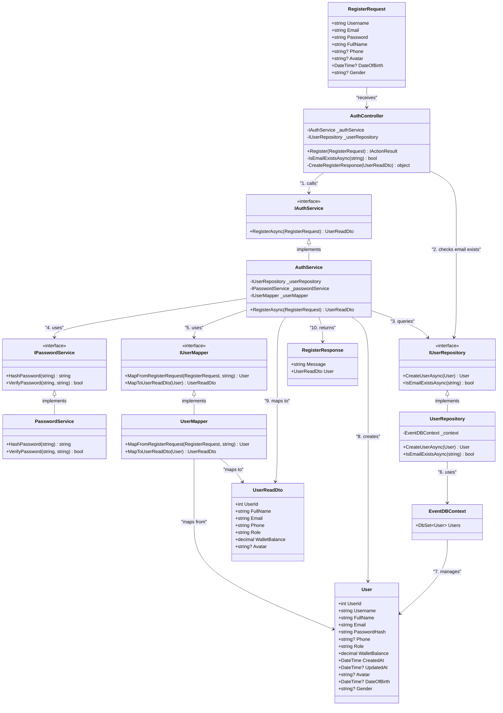

# Class Diagram - Register Flow

## Mô tả
Class diagram này mô tả luồng đăng ký (register) trong hệ thống TheGrind5 Event Management, tương tự như luồng login đã có.

## Class Diagram

## Luồng Register Flow

### 1. Nhận Request
- `RegisterRequest` được gửi đến `AuthController.Register()`
- Controller kiểm tra email đã tồn tại chưa qua `IUserRepository.IsEmailExistsAsync()`

### 2. Xử lý Register
- `AuthController` gọi `IAuthService.RegisterAsync()`
- `AuthService` sử dụng `IPasswordService.HashPassword()` để hash mật khẩu
- `AuthService` sử dụng `IUserMapper.MapFromRegisterRequest()` để tạo User entity

### 3. Lưu Database
- `AuthService` gọi `IUserRepository.CreateUserAsync()` để lưu user vào database
- `UserRepository` sử dụng `EventDBContext` để thao tác với database
- `EventDBContext` quản lý `User` entity trong database

### 4. Trả về Response
- `AuthService` sử dụng `IUserMapper.MapToUserReadDto()` để tạo DTO
- Trả về `UserReadDto` cho `AuthController`
- `AuthController` tạo `RegisterResponse` và trả về cho client

## Các thành phần chính

### Controller Layer
- **AuthController**: Entry point cho register request
- Xử lý validation và response formatting

### Service Layer  
- **IAuthService/AuthService**: Business logic cho register
- **IPasswordService/PasswordService**: Xử lý hash password
- **IUserMapper/UserMapper**: Mapping giữa DTOs và Entities

### Repository Layer
- **IUserRepository/UserRepository**: Data access layer
- **EventDBContext**: Database context

### Models & DTOs
- **User**: Entity model
- **RegisterRequest**: Input DTO
- **UserReadDto**: Output DTO
- **RegisterResponse**: Final response

## Đặc điểm của Register Flow

1. **Validation**: Kiểm tra email đã tồn tại
2. **Security**: Hash password trước khi lưu
3. **Mapping**: Sử dụng mapper để chuyển đổi giữa DTOs và Entities
4. **Default Values**: Tự động set role = "Customer", wallet = 0
5. **Error Handling**: Try-catch để xử lý lỗi
6. **Clean Architecture**: Tách biệt rõ ràng các layer

## So sánh với Login Flow

| Aspect | Login Flow | Register Flow |
|--------|------------|---------------|
| Input | LoginRequest | RegisterRequest |
| Validation | Email/Password format | Email exists check |
| Password | Verify existing hash | Hash new password |
| Output | LoginResponse (with token) | UserReadDto (no token) |
| Database | Read operation | Create operation |
| Security | JWT generation | Password hashing |
